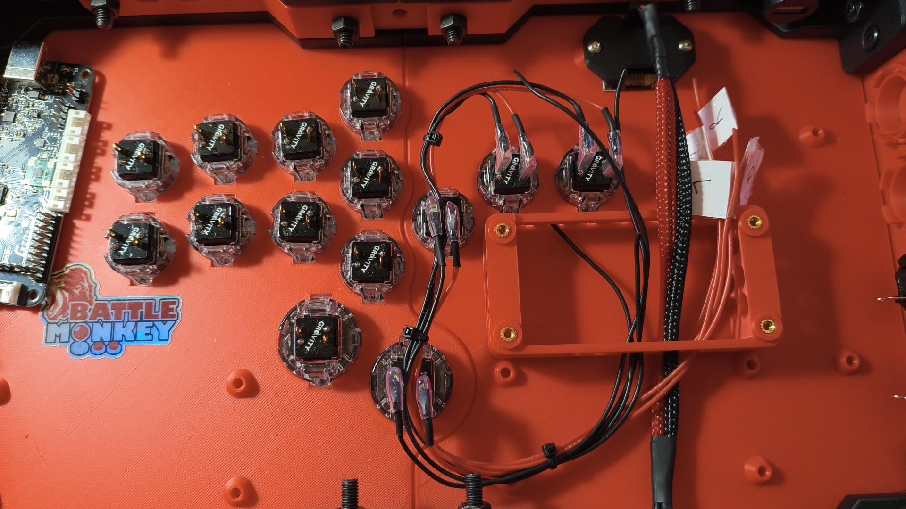

# BattleMonkey contributions

Parts contributed by **BattleMonkey Custom Arcade Sticks**
([@XBattleMonkeyX](https://x.com/XBattleMonkeyX)). Thank you, BattleMonkey.

Like everything else in this repository, these files are shared under
[CC BY-SA 4.0](../LICENSE) — see [NOTICE.md](../NOTICE.md) for the attribution
register.

---

## Brook cable caddy — `caja brook cables v1.2`

*The caddy installed in one of BattleMonkey's builds: the open frame sits on
the fight board mount points and the sleeved cable bundle routes cleanly past
it to the board.*

A 3D printed mounting caddy for a Brook fight board that doubles as cable
management: it holds the PCB on the case's mount points and gives the sleeved
cable bundle a clean, strain free path to the board terminals.

| | |
|---|---|
| Footprint | approx. 107.5 x 50 mm, 21 mm tall |
| Mounts to | the four PCB mount points on the plexi case's inner layer |
| Inserts | 8x M3 x 5 mm heat set inserts |
| Files | [`caja brook cables v1.2.STEP`](caja%20brook%20cables%20v1.2.STEP) (AP203) &middot; [`caja brook cables v1.2.SLDPRT`](caja%20brook%20cables%20v1.2.SLDPRT) (SolidWorks 2022) |

### Printing and installing

1. Print the caddy. No STL is provided yet; export one from the STEP or
   SLDPRT at your slicer's preferred settings.
2. Heat press the eight M3 x 5 mm inserts into the bosses.
3. Bolt the caddy to the four PCB mount points on the inner layer of the
   [plexi case](../case/README.md), then mount the fight board to the caddy.
4. Route the sleeved cables through the frame to the board.

### Planned updates

- A variant that mounts on only the two inner M3 points.
- Boss sizing for standard Ruthex M3 heat set inserts.

If you build with it, photos in the
[issues](https://github.com/JasensCustoms/FightStickLayoutProject/issues) are
always welcome.
