# Arcade Control Panel Layouts, SVG and DXF Cut Files

**Arcade control panel layouts as true scale vector cut files, ready for CAD and CAM.**

The founding set is converted from [slagcoin.com](https://www.slagcoin.com/joystick/layout.html). More layouts get added over time, from other sources and drawn fresh, and every one carries its own credit.


Everything is drawn 1:1 in millimetres, ready to send to a laser, router or CNC. Two families:

- **Joystick layouts**, 21 button arrangements, each supplied at 3 different lever positions and in both 30 mm and 24 mm button sizes, with the lever mounting hardware included.
- **All button layouts**, 7 leverless panels, drawn as designed with their native mix of 24 mm and 30 mm holes.
- **Manufacturer layouts**, taken from commercial sticks. Three so far, the ASI S24, S30 and B30.

Every one of those also ships in an **inner support** version, where each button hole is merged with a relief slot for Sanwa OBSF snap in button ears. That comes to 266 layouts per format, 532 files.

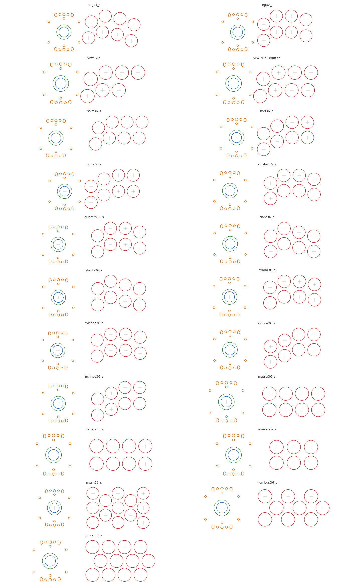

---

## Credit where it belongs

> This repository started with **slagcoin.com**, and would not exist without it.
>
> That site has been the reference for arcade stick building for well over fifteen years. The panel layout page, the button and joystick measurement pages, the drilling and wiring guides. It is still the most careful and most useful writeup on the subject that anyone has put on the internet, and it was given away for free.
>
> Every layout in the founding set is traced from Slagcoin's own to scale diagrams, and each of those catalogue entries quotes his description. If you build anything from these files, go read [the original pages](https://www.slagcoin.com/joystick/layout.html) first. There is a lot of reasoning there about *why* the layouts are shaped the way they are, and it will make you better at picking one.

The all button layouts come from a different place. They were created by [JasensCustoms.com](https://www.jasenscustoms.com) and members of the Panzer user community, and are credited in [their own section](#all-button-layouts). The S24, S30 and B30 layouts belong to [ASI](#asi-s24).

**Where a layout came from is recorded with the layout.** Every catalogue entry names its origin, and [NOTICE.md](NOTICE.md) is the full register of sources. Nothing in here silently claims someone else's design work.

---

## Contents

- [Quick start](#quick-start)
- [What is in the box](#what-is-in-the-box)
- [Reading the file names](#reading-the-file-names)
- [What is in every file](#what-is-in-every-file)
- [Joystick spacing](#joystick-spacing)
- [24 mm button versions](#24-mm-button-versions)
- [Inner support versions](#inner-support-versions)
- [Layout catalogue](#layout-catalogue)
  - [Japanese arcade standards](#japanese-arcade-standards)
  - [Vewlix family](#vewlix-family)
  - [Hori transitioning](#hori-transitioning)
  - [Clustered arcade](#clustered-arcade)
  - [Direct slant](#direct-slant)
  - [Moderate and hybrid](#moderate-and-hybrid)
  - [Straight incline](#straight-incline)
  - [Grids and squares](#grids-and-squares)
  - [Templates](#templates)
- [Full index](#full-index)
- [All button layouts](#all-button-layouts)
  - [Traditional](#traditional)
  - [Modern](#modern)
  - [Tomahawk](#tomahawk)
  - [Aegis](#aegis)
  - [Shiokenstar](#shiokenstar)
  - [Slab Split](#slab-split)
  - [Split Modern](#split-modern)
  - [All button index](#all-button-index)
- [Manufacturer layouts](#manufacturer-layouts)
  - [ASI S24](#asi-s24)
  - [ASI S30](#asi-s30)
  - [ASI B30](#asi-b30)
- [Before you cut](#before-you-cut)
- [How these were made](#how-these-were-made)
- [Licence and attribution](#licence-and-attribution)

---

## Quick start

**If you just want the popular one:** grab [`vewlix_s_8button.dxf`](dxf/vewlix_s_8button.dxf). That is the modern 8 button tournament layout, 30 mm buttons, at the stock Japanese lever position. Running 24 mm buttons? Take [`vewlix_s_8button_24mm_buttons.dxf`](dxf/vewlix_s_8button_24mm_buttons.dxf) instead.

**If you are not sure which layout suits you:** print a few SVGs at 100 percent scale, lay your hand on them, and pick the one that feels right. This costs a sheet of paper and will save you a ruined panel.

**Three things to do before sending anything to a machine:**

1. Delete whichever of the two joystick bore layers you are not using.
2. Delete the `REFERENCE` layer. Those crosshairs are alignment aids, not cuts.
3. Cut one in scrap first.

---

## What is in the box

```
dxf/        272 layouts as .dxf   (R2010, millimetres, $INSUNITS = 4)
svg/        the same 272 layouts as .svg  (1 user unit = 1 mm)
preview/    per layout PNG previews plus contact sheets and diagrams
README.md   this file
```

Joystick arrangements are built out to 6 files per format: 3 lever positions, each at 30 mm and 24 mm button sizes. The 21 of them come to 126 per format. All button layouts ship as a single file each, adding 7 more, and manufacturer layouts likewise, adding 3, for 136. Each of those then has an inner support twin, doubling the count to 272 per format and 544 in total.

New layouts follow the same naming and layer conventions, so anything you script against the current set keeps working.

---

## Reading the file names

```
sega1_s                    the layout as Slagcoin drew it
       ^ "_s" is Slagcoin's own suffix for the 72 PPI source image

cluster36_s                the "36" means 36 mm button spacing

clusters36_s               the extra "s" before the "36" means Spaced rows.
                           Same layout, more gap between the two rows.
                           Standard rows sit 36 mm apart, spaced rows 39 mm.

vewlix_s_82mm_spacing      joystick moved to 82 mm from the first button column
vewlix_s_95mm_spacing      joystick moved to 95 mm from the first button column

vewlix_s_24mm_buttons                24 mm buttons instead of 30 mm
vewlix_s_82mm_spacing_24mm_buttons   both at once

traditional_all_button     a leverless layout. No lever, so no spacing or
                           button size variants, just the one file.

inner_support_traditional_all_button       any file, with Sanwa OBSF ear
inner_support_vewlix_s_82mm_spacing        relief slots added on every button
```

The `inner_support_` prefix goes on the front. Every other suffix keeps its meaning and its order.

---

## What is in every file

Millimetres throughout. In the SVG, 1 user unit equals 1 mm and the width and height are declared in mm, so it imports at true size without scaling. The origin (0,0) is the centre of the joystick shaft hole, with +X toward the buttons and +Y toward the back of the panel.

There is no text, no title block and no border. Cut geometry only.

### Layers

| Layer | DXF colour | Contents |
|---|---|---|
| `BUTTONS` | 1, red | 30 mm button holes |
| `JOYSTICK_BORE_24` | 5, blue | 24 mm shaft clearance hole |
| `JOYSTICK_BORE_35.25` | 3, green | 35.25 mm bore matching the mounting plate |
| `GL_PLATE_HOLES` | 2, yellow | Lever mounting holes and slots |
| `REFERENCE` | 8, grey | Centre crosshairs only, do not cut |

On inner support files the button layers carry closed profiles rather than plain circles. No extra layer is added.

All button layouts use a different set, since they have no lever and mix hole sizes: `BUTTONS_24`, `BUTTONS_30` and `REFERENCE`. See [All button layouts](#all-button-layouts).

### The two joystick bores

They sit concentrically on top of each other. **Pick one and delete the other.**

| Bore | Use it when |
|---|---|
| **24 mm** | The mounting plate bolts flat to the underside of the panel and only the shaft comes through. This is the classic shaft clearance hole. |
| **35.25 mm** | You want a recess or pocket, or the plate sitting up inside the opening. Matches the bore of the universal mounting plate. |

### Lever mounting holes

`GL_PLATE_HOLES` carries the universal mounting plate pattern, so a single panel will accept a range of different levers. You get two ear holes and two slots at the top and bottom, a pair on the centreline, and four corner holes. Drill only the ones your lever actually needs and ignore the rest.

The plate runs tall rather than wide, so rotate that layer 90 degrees if your lever mounts sideways.

Button holes are 30 mm unless the file name says `_24mm_buttons`. See [24 mm button versions](#24-mm-button-versions).

---

## Joystick spacing

This section applies to the joystick layouts. All button layouts have no lever, so they have no spacing variants.

Slagcoin dimensions every diagram from the centreline of the first (left most) button column. That is the reference point. When the original drawings put "59mm / 63mm / 95mm" next to the stick, that is the horizontal distance from the stick centre back to that column.

> A horizontal distance of about 5.9, 6.3, or 9.5 centimeters between the middle of the joystick and the middle of the leftmost button are common standards.
>
> *Slagcoin*

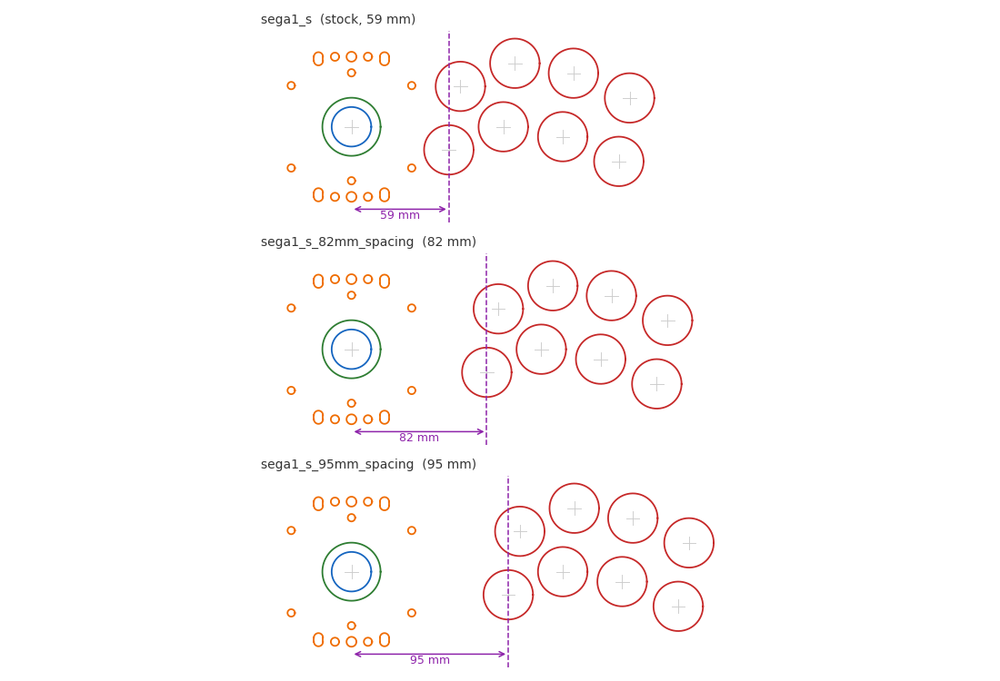

Every layout ships three times:

| Suffix | Joystick position |
|---|---|
| *(none)* | Exactly as Slagcoin drew it |
| `_82mm_spacing` | 82 mm from the first button column |
| `_95mm_spacing` | 95 mm from the first button column |

Only the horizontal distance changes. Everything vertical stays put, including how high the stick sits relative to the rows. The button cluster, both bores and the plate holes are identical across all three.

Stock spacing is not the same on every layout:

| Stock spacing | Layouts |
|---|---|
| 59 mm | `sega1_s`, `vewlix_s`, `vewlix_s_8button` |
| 63 mm | `sega2_s` |
| 63.75 mm | `hori36_s`, `horis36_s` |
| 95 mm | the other 15 |

### Which one do you want

| Spacing | Feel |
|---|---|
| **59 to 63 mm** | Japanese arcade standard. Hands close together, elbows fairly straight. This is what an Astro City or a Vewlix actually feels like. |
| **82 mm** | The middle ground. Good for big hands, a wider stance, or a bat top or tall shaft where your left hand needs more room. |
| **95 mm** | American and Capcom style roomy spacing. Also useful for a large lever, a Korean lever with a big plate, or clearing a taller dust washer. |

Two honest caveats:

1. Fifteen layouts are already drawn at 95 mm, so for those the `_95mm_spacing` file is identical to the stock file. It exists so the naming stays predictable across the whole set.
2. For those same fifteen, the `_82mm_spacing` file pulls the lever closer to the buttons rather than further away.

---

## 24 mm button versions

Every joystick layout also comes in a 24 mm button version, marked `_24mm_buttons` in the file name. All button layouts are drawn with their native mix of 24 mm and 30 mm holes and do not need this treatment.

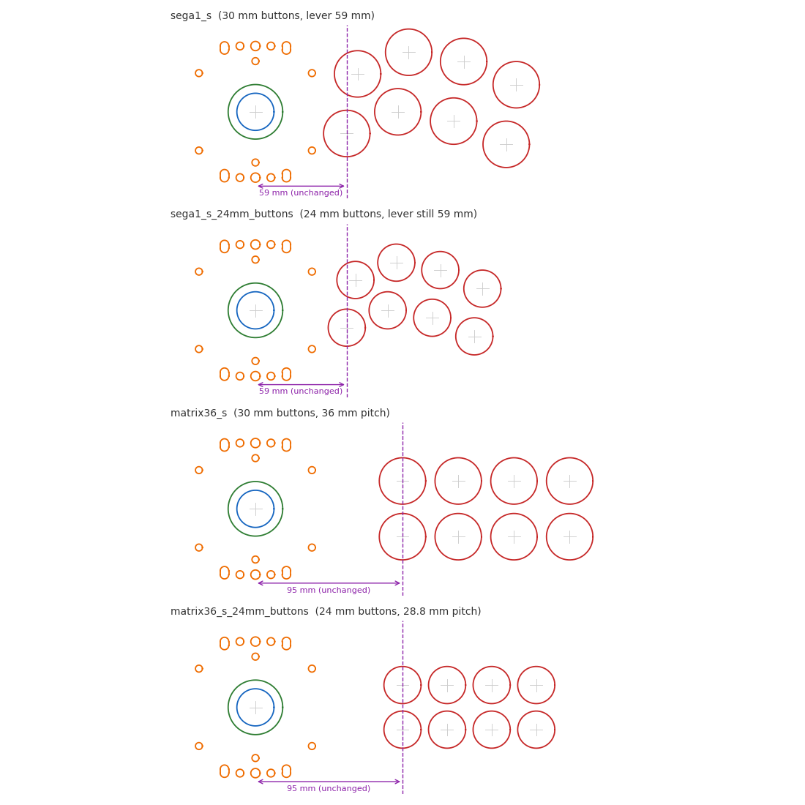

These are not simply the same drawing with smaller holes punched in it. The whole button cluster is scaled down by the same factor as the holes, so the layout keeps its proportions:

| | 30 mm files | 24 mm files |
|---|---|---|
| Button hole | 30.00 mm | 24.00 mm |
| Button to button spacing | as drawn | scaled by 0.8, horizontally and vertically |
| Typical pitch | 36 mm | 28.8 mm |
| Joystick position | unchanged | **unchanged** |
| Lever spacing (59 / 63 / 82 / 95 mm) | unchanged | **unchanged** |
| Mounting hardware | unchanged | **unchanged** |

**What stays fixed.** The joystick sits at the origin in both versions, the mounting plate holes and both bores are byte for byte identical, and the distance from the lever to the first button column does not move. A `_95mm_spacing_24mm_buttons` file still has its lever at exactly 95 mm.

**How the shrink is anchored.** Horizontally the cluster is scaled about the first button column, which is the datum the lever spacing is measured to, so that distance is preserved exactly. Vertically it is scaled about the joystick centreline, which is the datum Slagcoin's own vertical callouts use, so the lever keeps the same proportional position relative to the rows.

> **Check your button clearance before cutting.** A 36 mm pitch becomes 28.8 mm, and on the tighter layouts the closest pair lands around 28.4 mm. Snap in 24 mm buttons are usually fine at that spacing. Screw in 24 mm buttons have wider nuts and may not be, so measure yours first. Each layout below lists its closest pitch at both sizes.

---

## Inner support versions

Every layout in the repository has an inner support twin, named by putting `inner_support_` in front of the ordinary file name.

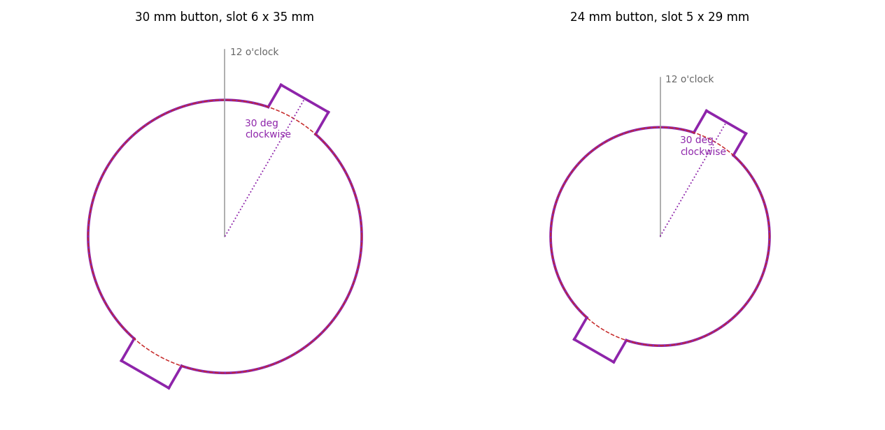

An inner support file is the complete original layout with every button hole replaced by a single closed profile: the hole unioned with a rectangular ear relief slot. The slot is centred on the hole and its long axis is rotated **30 degrees from vertical**, clockwise by default, so it runs from roughly 7 o'clock up to 1 o'clock.

| Button | Slot size | Sticks out past the hole |
|---|---|---|
| 30 mm | 6 mm wide x 35 mm long | 2.5 mm each end |
| 24 mm | 5 mm wide x 29 mm long | 2.5 mm each end |

**The slots are modelled on the retention ears of Sanwa OBSF snap in buttons.** Those buttons have a pair of sprung tabs on the body that need somewhere to sit. On a stacked panel the top sheet takes the plain hole and the sheet underneath, the inner support, needs the ear clearance cut into it as well.

**One profile per button.** The circle and the slot are boolean unioned into a single closed outline, so there is exactly one contour to cut per button and no overlapping shapes to clean up. In DXF it is a closed `LWPOLYLINE` with true arc segments carried as bulges, not a polygon approximation. In SVG it is a closed `path` using `A` arc commands.

**Slot direction is not uniform.** The default is 30 degrees clockwise from vertical, but on tightly packed layouts two neighbouring buttons pointing their ears at each other leaves a dangerously thin web of material, and on the tightest layouts the two slots actually cut into one another. Where that happens the slot is turned to whichever direction opens the gap back up. Slots are allowed to sit at any multiple of 15 degrees, so a crowded button has eleven alternatives to the default rather than just its mirror image.

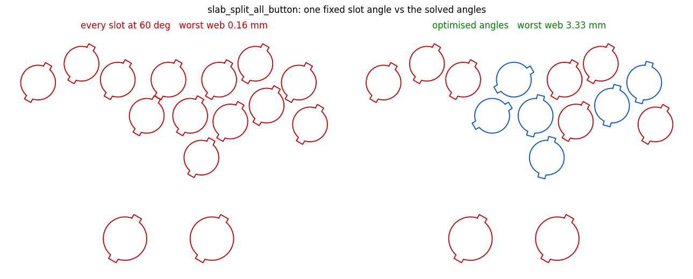

The angles are solved per layout rather than picked by eye. For every pair of neighbouring buttons the exact clearance between the two finished profiles is computed in closed form, for all 144 combinations of their angles. The solver then searches for the assignment that maximises the *smallest* web anywhere on the panel, and once it has found that maximum it makes a second pass pulling every button that can afford it back to the default angle. So a panel only carries a rotated slot where the rotation is actually buying material.

63 of the 136 layouts needed at least one rotated slot, 404 slots out of 1186 in total. 73 layouts are untouched at the default angle throughout.

The result across the whole library:

| | worst web on any layout | layouts under 2 mm | layouts with slots that overlap |
|---|---|---|---|
| Every slot at 30 deg clockwise | 0.00 mm | 10 | 3 |
| Solved angles | **3.33 mm** | **0** | **0** |

No layout now has a web under 3.3 mm. The tightest is `slab_split_all_button` at 3.33 mm; everything else is 3.83 mm or better. On 25 of the 52 distinct button patterns the slots stop being the limiting factor entirely, meaning the thinnest material on the panel is the plain hole to hole gap and adding the ear slots costs nothing at all.

**Buttons only.** Nothing is added to a joystick bore or to any mounting hole. The union is keyed off the button layers rather than off hole diameter, so the 24 mm `JOYSTICK_BORE_24` circle is never mistaken for a 24 mm button.

Profiles stay on the same layer their circle was on, and every other entity in the file is identical to its standard counterpart.

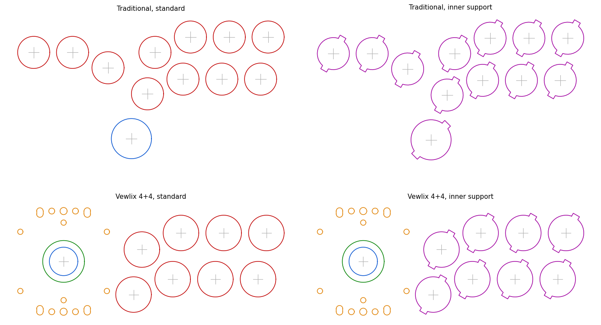

Every layout has its own inner support preview in `preview/`, and each catalogue entry below shows it beside the standard version. Contact sheets for the whole family:

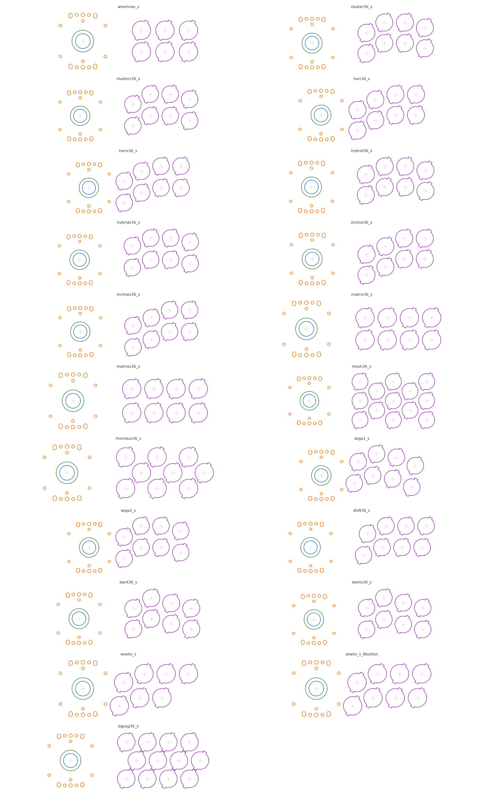

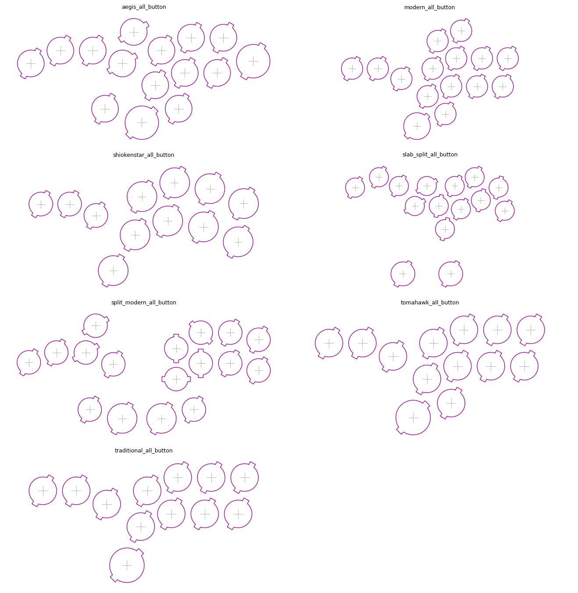

> **Why a union rather than two shapes.** Overlapping closed profiles are handled differently by different CAM packages, and getting it wrong leaves a floating sliver where the slot crosses the hole edge. A single merged contour removes the question.

---

## Layout catalogue

This section covers the joystick layouts. Leverless panels are in [All button layouts](#all-button-layouts).

Previews show the stock lever position with 30 mm buttons. Red is button holes, green and blue are the two joystick bores, orange is the lever mounting pattern, grey is the non cutting reference layer.

Every entry below is converted from a Slagcoin diagram, so each one quotes his description of it. Layouts added from other sources, or drawn from scratch, state their origin in their own entry.

---

## Japanese arcade standards

The most used layouts on earth. Slanted rows that follow the natural arch of your fingers.

### Sega Astro City / Blast City P1

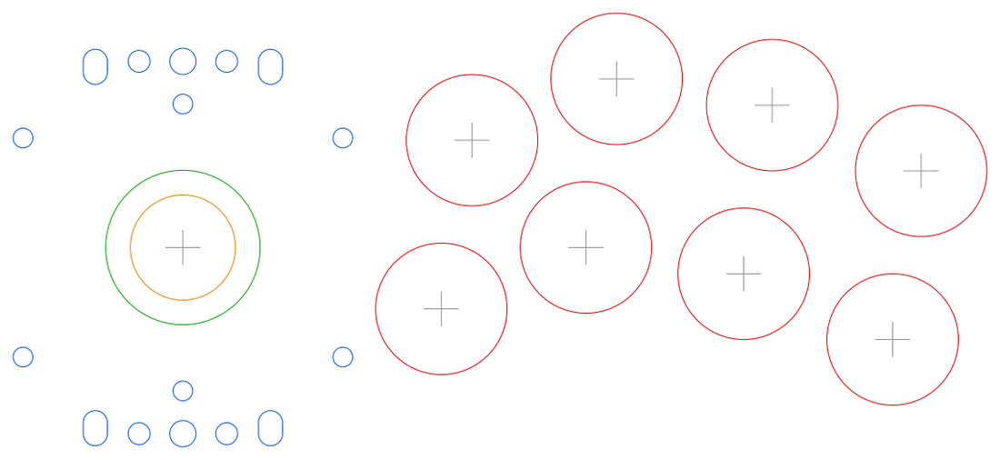 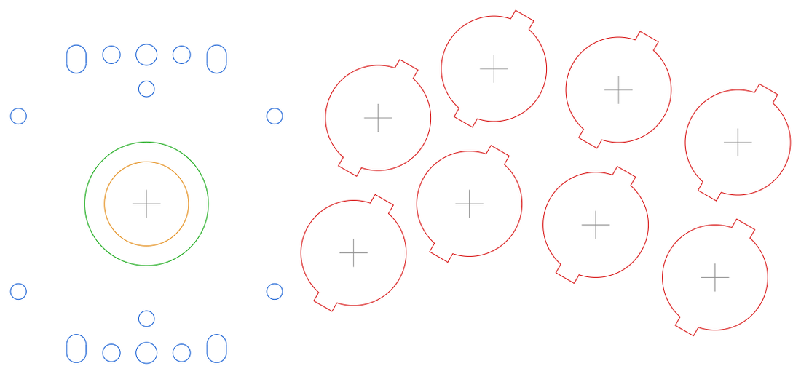

*Left: standard. Right: inner support, with the hole and its Sanwa OBSF ear relief merged into one profile.*

> A precise diagram of the Sega layout used in Astro City, Blast City, Net City, and Versus City cabinets for player 1 or single player. This layout (or an almost identical one) is used in most arcade machines and controllers in Japan. It is very appropriate for quick, comfortable, and precise play. If you have not used a slanted layout like this, feel it; it may surprise you.
>
> *Slagcoin*

If you have played on a Japanese candy cab, this is the muscle memory you already have. Every column is slanted, the top row sits a touch to the right of the bottom row, and the whole cluster arcs up and then back down.

> **Nut clearance:** the two closest buttons land just under 36 mm apart, so standard Sanwa screw in nuts can touch. Seimitsu nuts or snap ins solve it.

**8 buttons**  |  stock lever at **59 mm**  |  closest button pitch 35.7 mm at 30 mm, 28.6 mm at 24 mm  |  cut envelope 222 x 99 mm

More previews: [24 mm buttons](preview/sega1_s_24mm_buttons.png) &middot; [24 mm inner support](preview/inner_support_sega1_s_24mm_buttons.png)

| Version | 30 mm buttons | 24 mm buttons |
|---|---|---|
| Stock | [dxf](dxf/sega1_s.dxf) &middot; [svg](svg/sega1_s.svg) | [dxf](dxf/sega1_s_24mm_buttons.dxf) &middot; [svg](svg/sega1_s_24mm_buttons.svg) |
| Stock, inner support | [dxf](dxf/inner_support_sega1_s.dxf) &middot; [svg](svg/inner_support_sega1_s.svg) | [dxf](dxf/inner_support_sega1_s_24mm_buttons.dxf) &middot; [svg](svg/inner_support_sega1_s_24mm_buttons.svg) |
| 82 mm | [dxf](dxf/sega1_s_82mm_spacing.dxf) &middot; [svg](svg/sega1_s_82mm_spacing.svg) | [dxf](dxf/sega1_s_82mm_spacing_24mm_buttons.dxf) &middot; [svg](svg/sega1_s_82mm_spacing_24mm_buttons.svg) |
| 82 mm, inner support | [dxf](dxf/inner_support_sega1_s_82mm_spacing.dxf) &middot; [svg](svg/inner_support_sega1_s_82mm_spacing.svg) | [dxf](dxf/inner_support_sega1_s_82mm_spacing_24mm_buttons.dxf) &middot; [svg](svg/inner_support_sega1_s_82mm_spacing_24mm_buttons.svg) |
| 95 mm | [dxf](dxf/sega1_s_95mm_spacing.dxf) &middot; [svg](svg/sega1_s_95mm_spacing.svg) | [dxf](dxf/sega1_s_95mm_spacing_24mm_buttons.dxf) &middot; [svg](svg/sega1_s_95mm_spacing_24mm_buttons.svg) |
| 95 mm, inner support | [dxf](dxf/inner_support_sega1_s_95mm_spacing.dxf) &middot; [svg](svg/inner_support_sega1_s_95mm_spacing.svg) | [dxf](dxf/inner_support_sega1_s_95mm_spacing_24mm_buttons.dxf) &middot; [svg](svg/inner_support_sega1_s_95mm_spacing_24mm_buttons.svg) |


### Sega P2, non slanted

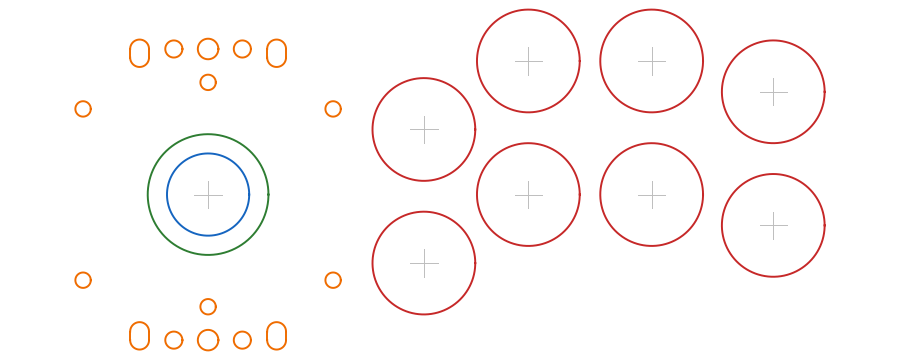 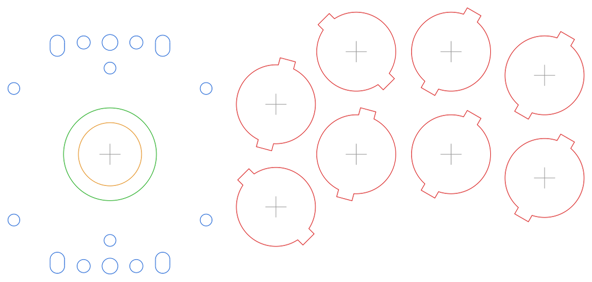

*Left: standard. Right: inner support, with the hole and its Sanwa OBSF ear relief merged into one profile.*

> A precise diagram of the Sega layout for player 2. It is very close to a non-slanted version of the player 1, but has a few differently proportioned buttons; it can be tilted to something similar to the player 1 layout. A few alternate placements of the pinky buttons are noted.
>
> *Slagcoin*

Straight columns instead of slanted ones. Easier to lay out, easier to fit in a rectangular panel, and plenty of people simply prefer it. Rows sit 39 mm apart and the pinky column steps down a little.

**8 buttons**  |  stock lever at **63 mm**  |  closest button pitch 35.9 mm at 30 mm, 28.7 mm at 24 mm  |  cut envelope 219 x 100 mm

More previews: [24 mm buttons](preview/sega2_s_24mm_buttons.png) &middot; [24 mm inner support](preview/inner_support_sega2_s_24mm_buttons.png)

| Version | 30 mm buttons | 24 mm buttons |
|---|---|---|
| Stock | [dxf](dxf/sega2_s.dxf) &middot; [svg](svg/sega2_s.svg) | [dxf](dxf/sega2_s_24mm_buttons.dxf) &middot; [svg](svg/sega2_s_24mm_buttons.svg) |
| Stock, inner support | [dxf](dxf/inner_support_sega2_s.dxf) &middot; [svg](svg/inner_support_sega2_s.svg) | [dxf](dxf/inner_support_sega2_s_24mm_buttons.dxf) &middot; [svg](svg/inner_support_sega2_s_24mm_buttons.svg) |
| 82 mm | [dxf](dxf/sega2_s_82mm_spacing.dxf) &middot; [svg](svg/sega2_s_82mm_spacing.svg) | [dxf](dxf/sega2_s_82mm_spacing_24mm_buttons.dxf) &middot; [svg](svg/sega2_s_82mm_spacing_24mm_buttons.svg) |
| 82 mm, inner support | [dxf](dxf/inner_support_sega2_s_82mm_spacing.dxf) &middot; [svg](svg/inner_support_sega2_s_82mm_spacing.svg) | [dxf](dxf/inner_support_sega2_s_82mm_spacing_24mm_buttons.dxf) &middot; [svg](svg/inner_support_sega2_s_82mm_spacing_24mm_buttons.svg) |
| 95 mm | [dxf](dxf/sega2_s_95mm_spacing.dxf) &middot; [svg](svg/sega2_s_95mm_spacing.svg) | [dxf](dxf/sega2_s_95mm_spacing_24mm_buttons.dxf) &middot; [svg](svg/sega2_s_95mm_spacing_24mm_buttons.svg) |
| 95 mm, inner support | [dxf](dxf/inner_support_sega2_s_95mm_spacing.dxf) &middot; [svg](svg/inner_support_sega2_s_95mm_spacing.svg) | [dxf](dxf/inner_support_sega2_s_95mm_spacing_24mm_buttons.dxf) &middot; [svg](svg/inner_support_sega2_s_95mm_spacing_24mm_buttons.svg) |


---

## Vewlix family

The modern tournament standard. The top row is shifted right relative to the bottom row.


### Vewlix, 7 button as drawn

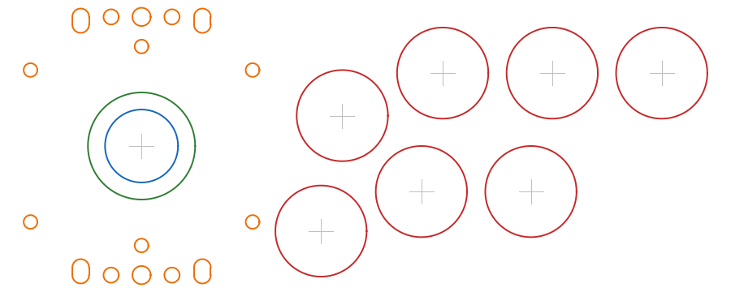 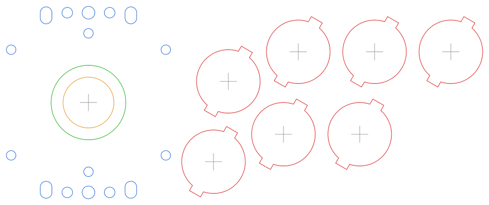

*Left: standard. Right: inner support, with the hole and its Sanwa OBSF ear relief merged into one profile.*

> This layout takes the arcade layout and shifts the top row a bit to the right. This is the precise layout used in Taito Vewlix cabinets. Note that the bottom index and middle finger buttons are closer than 36mm to one another; they will not work with nuts stocked with Sanwa screw-in buttons.
>
> *Slagcoin*

This is Slagcoin's diagram traced literally, and the original only draws 7 holes. The 8th position is marked on the source as a small optional dot rather than a real hole, so it lives in its own file below.

> **Nut clearance, and this one is real:** the closest button pair sits about 35.5 mm apart centre to centre. Standard Sanwa screw in nuts are roughly 35 to 36 mm across and they will fight each other. Use the thinner Seimitsu nuts, use snap in buttons, or plan on filing a nut flat.

**7 buttons**  |  stock lever at **59 mm**  |  closest button pitch 35.5 mm at 30 mm, 28.4 mm at 24 mm  |  cut envelope 225 x 91 mm

More previews: [24 mm buttons](preview/vewlix_s_24mm_buttons.png) &middot; [24 mm inner support](preview/inner_support_vewlix_s_24mm_buttons.png)

| Version | 30 mm buttons | 24 mm buttons |
|---|---|---|
| Stock | [dxf](dxf/vewlix_s.dxf) &middot; [svg](svg/vewlix_s.svg) | [dxf](dxf/vewlix_s_24mm_buttons.dxf) &middot; [svg](svg/vewlix_s_24mm_buttons.svg) |
| Stock, inner support | [dxf](dxf/inner_support_vewlix_s.dxf) &middot; [svg](svg/inner_support_vewlix_s.svg) | [dxf](dxf/inner_support_vewlix_s_24mm_buttons.dxf) &middot; [svg](svg/inner_support_vewlix_s_24mm_buttons.svg) |
| 82 mm | [dxf](dxf/vewlix_s_82mm_spacing.dxf) &middot; [svg](svg/vewlix_s_82mm_spacing.svg) | [dxf](dxf/vewlix_s_82mm_spacing_24mm_buttons.dxf) &middot; [svg](svg/vewlix_s_82mm_spacing_24mm_buttons.svg) |
| 82 mm, inner support | [dxf](dxf/inner_support_vewlix_s_82mm_spacing.dxf) &middot; [svg](svg/inner_support_vewlix_s_82mm_spacing.svg) | [dxf](dxf/inner_support_vewlix_s_82mm_spacing_24mm_buttons.dxf) &middot; [svg](svg/inner_support_vewlix_s_82mm_spacing_24mm_buttons.svg) |
| 95 mm | [dxf](dxf/vewlix_s_95mm_spacing.dxf) &middot; [svg](svg/vewlix_s_95mm_spacing.svg) | [dxf](dxf/vewlix_s_95mm_spacing_24mm_buttons.dxf) &middot; [svg](svg/vewlix_s_95mm_spacing_24mm_buttons.svg) |
| 95 mm, inner support | [dxf](dxf/inner_support_vewlix_s_95mm_spacing.dxf) &middot; [svg](svg/inner_support_vewlix_s_95mm_spacing.svg) | [dxf](dxf/inner_support_vewlix_s_95mm_spacing_24mm_buttons.dxf) &middot; [svg](svg/inner_support_vewlix_s_95mm_spacing_24mm_buttons.svg) |


### Vewlix 4+4, 8 button

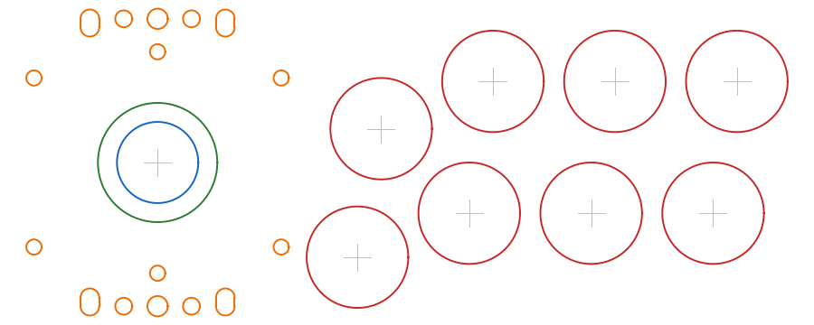 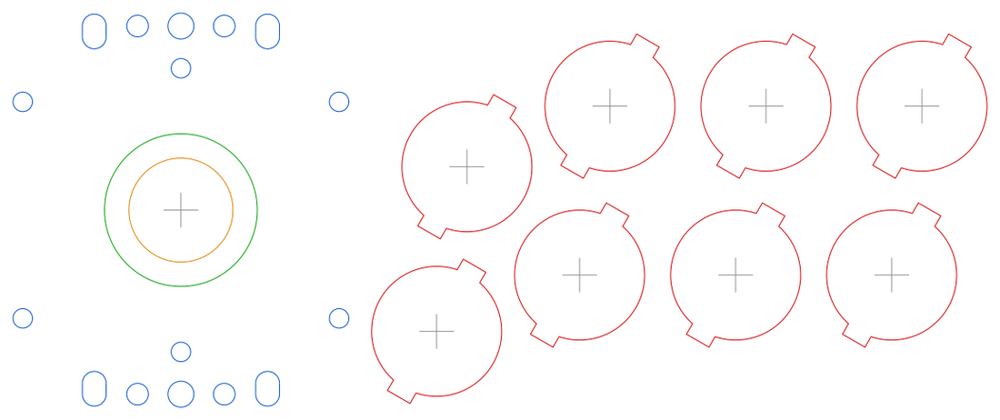

*Left: standard. Right: inner support, with the hole and its Sanwa OBSF ear relief merged into one profile.*

> The added isolated small dots in the images represent alternate places for joysticks and buttons.
>
> *Slagcoin*

Same layout as `vewlix_s` with the 8th hole added at the optional position Slagcoin marks with a dot. That completes a clean 4 top and 4 bottom grid, where each upper button sits slightly right of and well above its lower partner.

**This is the one most people actually want.** If you are building a modern 8 button stick and someone says "Vewlix layout", they mean this.

> Same nut clearance warning as `vewlix_s`.

**8 buttons**  |  stock lever at **59 mm**  |  closest button pitch 35.5 mm at 30 mm, 28.4 mm at 24 mm  |  cut envelope 225 x 91 mm

More previews: [24 mm buttons](preview/vewlix_s_8button_24mm_buttons.png) &middot; [24 mm inner support](preview/inner_support_vewlix_s_8button_24mm_buttons.png)

| Version | 30 mm buttons | 24 mm buttons |
|---|---|---|
| Stock | [dxf](dxf/vewlix_s_8button.dxf) &middot; [svg](svg/vewlix_s_8button.svg) | [dxf](dxf/vewlix_s_8button_24mm_buttons.dxf) &middot; [svg](svg/vewlix_s_8button_24mm_buttons.svg) |
| Stock, inner support | [dxf](dxf/inner_support_vewlix_s_8button.dxf) &middot; [svg](svg/inner_support_vewlix_s_8button.svg) | [dxf](dxf/inner_support_vewlix_s_8button_24mm_buttons.dxf) &middot; [svg](svg/inner_support_vewlix_s_8button_24mm_buttons.svg) |
| 82 mm | [dxf](dxf/vewlix_s_8button_82mm_spacing.dxf) &middot; [svg](svg/vewlix_s_8button_82mm_spacing.svg) | [dxf](dxf/vewlix_s_8button_82mm_spacing_24mm_buttons.dxf) &middot; [svg](svg/vewlix_s_8button_82mm_spacing_24mm_buttons.svg) |
| 82 mm, inner support | [dxf](dxf/inner_support_vewlix_s_8button_82mm_spacing.dxf) &middot; [svg](svg/inner_support_vewlix_s_8button_82mm_spacing.svg) | [dxf](dxf/inner_support_vewlix_s_8button_82mm_spacing_24mm_buttons.dxf) &middot; [svg](svg/inner_support_vewlix_s_8button_82mm_spacing_24mm_buttons.svg) |
| 95 mm | [dxf](dxf/vewlix_s_8button_95mm_spacing.dxf) &middot; [svg](svg/vewlix_s_8button_95mm_spacing.svg) | [dxf](dxf/vewlix_s_8button_95mm_spacing_24mm_buttons.dxf) &middot; [svg](svg/vewlix_s_8button_95mm_spacing_24mm_buttons.svg) |
| 95 mm, inner support | [dxf](dxf/inner_support_vewlix_s_8button_95mm_spacing.dxf) &middot; [svg](svg/inner_support_vewlix_s_8button_95mm_spacing.svg) | [dxf](dxf/inner_support_vewlix_s_8button_95mm_spacing_24mm_buttons.dxf) &middot; [svg](svg/inner_support_vewlix_s_8button_95mm_spacing_24mm_buttons.svg) |


### Generic shift

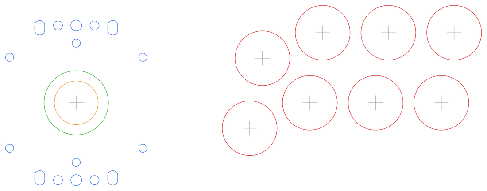 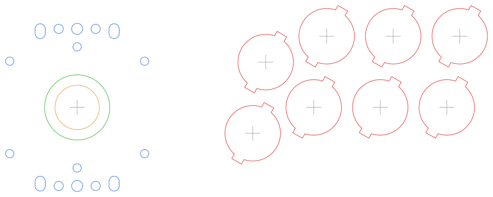

*Left: standard. Right: inner support, with the hole and its Sanwa OBSF ear relief merged into one profile.*

> This is a generic version of the Vewlix shifted layout. Note the top index and bottom middle finger buttons are closer together than the standard spacing and will not work with Sanwa nuts.
>
> *Slagcoin*

The same shift concept, tidied up into round numbers, with a flat 36 mm column pitch and a consistent step up and to the right from the bottom row to the top.

> Same nut clearance caution as Vewlix, for the same reason.

**8 buttons**  |  stock lever at **95 mm**  |  closest button pitch 35.7 mm at 30 mm, 28.6 mm at 24 mm  |  cut envelope 261 x 99 mm

More previews: [24 mm buttons](preview/shift36_s_24mm_buttons.png) &middot; [24 mm inner support](preview/inner_support_shift36_s_24mm_buttons.png)

| Version | 30 mm buttons | 24 mm buttons |
|---|---|---|
| Stock | [dxf](dxf/shift36_s.dxf) &middot; [svg](svg/shift36_s.svg) | [dxf](dxf/shift36_s_24mm_buttons.dxf) &middot; [svg](svg/shift36_s_24mm_buttons.svg) |
| Stock, inner support | [dxf](dxf/inner_support_shift36_s.dxf) &middot; [svg](svg/inner_support_shift36_s.svg) | [dxf](dxf/inner_support_shift36_s_24mm_buttons.dxf) &middot; [svg](svg/inner_support_shift36_s_24mm_buttons.svg) |
| 82 mm | [dxf](dxf/shift36_s_82mm_spacing.dxf) &middot; [svg](svg/shift36_s_82mm_spacing.svg) | [dxf](dxf/shift36_s_82mm_spacing_24mm_buttons.dxf) &middot; [svg](svg/shift36_s_82mm_spacing_24mm_buttons.svg) |
| 82 mm, inner support | [dxf](dxf/inner_support_shift36_s_82mm_spacing.dxf) &middot; [svg](svg/inner_support_shift36_s_82mm_spacing.svg) | [dxf](dxf/inner_support_shift36_s_82mm_spacing_24mm_buttons.dxf) &middot; [svg](svg/inner_support_shift36_s_82mm_spacing_24mm_buttons.svg) |
| 95 mm | [dxf](dxf/shift36_s_95mm_spacing.dxf) &middot; [svg](svg/shift36_s_95mm_spacing.svg) | [dxf](dxf/shift36_s_95mm_spacing_24mm_buttons.dxf) &middot; [svg](svg/shift36_s_95mm_spacing_24mm_buttons.svg) |
| 95 mm, inner support | [dxf](dxf/inner_support_shift36_s_95mm_spacing.dxf) &middot; [svg](svg/inner_support_shift36_s_95mm_spacing.svg) | [dxf](dxf/inner_support_shift36_s_95mm_spacing_24mm_buttons.dxf) &middot; [svg](svg/inner_support_shift36_s_95mm_spacing_24mm_buttons.svg) |


---

## Hori transitioning


### Hori transitioning

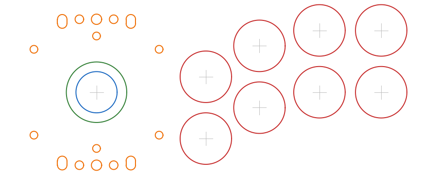 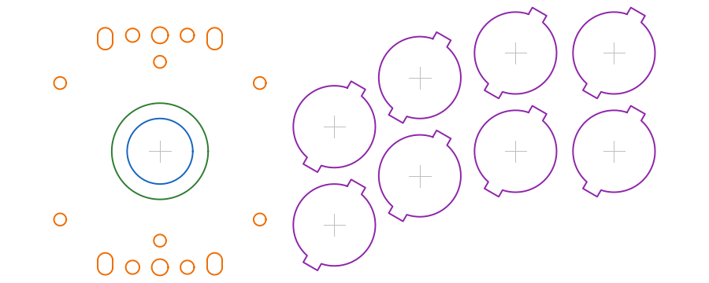

*Left: standard. Right: inner support, with the hole and its Sanwa OBSF ear relief merged into one profile.*

> This is a transitioning layout used by Hori in some of their joysticks. Some dots are added to show where to put the joystick if only using the right six buttons. In most of their joysticks, they use the standard Japanese arcade layout.
>
> *Slagcoin*

Starts stepped on the left and flattens out into a straight pair of rows on the right. A nice compromise if a full slant feels like too much but a flat grid feels too square.

> **About that 63.75 mm.** It looks like a typo but it is not. Slagcoin drew the stick where it belongs if you only use the right six buttons, which puts it exactly 95 mm from the second column. The `_82mm` and `_95mm` files measure from the first column like everything else in this repository.

**8 buttons**  |  stock lever at **63.75 mm**  |  closest button pitch 36.0 mm at 30 mm, 28.8 mm at 24 mm  |  cut envelope 220 x 96 mm

More previews: [24 mm buttons](preview/hori36_s_24mm_buttons.png) &middot; [24 mm inner support](preview/inner_support_hori36_s_24mm_buttons.png)

| Version | 30 mm buttons | 24 mm buttons |
|---|---|---|
| Stock | [dxf](dxf/hori36_s.dxf) &middot; [svg](svg/hori36_s.svg) | [dxf](dxf/hori36_s_24mm_buttons.dxf) &middot; [svg](svg/hori36_s_24mm_buttons.svg) |
| Stock, inner support | [dxf](dxf/inner_support_hori36_s.dxf) &middot; [svg](svg/inner_support_hori36_s.svg) | [dxf](dxf/inner_support_hori36_s_24mm_buttons.dxf) &middot; [svg](svg/inner_support_hori36_s_24mm_buttons.svg) |
| 82 mm | [dxf](dxf/hori36_s_82mm_spacing.dxf) &middot; [svg](svg/hori36_s_82mm_spacing.svg) | [dxf](dxf/hori36_s_82mm_spacing_24mm_buttons.dxf) &middot; [svg](svg/hori36_s_82mm_spacing_24mm_buttons.svg) |
| 82 mm, inner support | [dxf](dxf/inner_support_hori36_s_82mm_spacing.dxf) &middot; [svg](svg/inner_support_hori36_s_82mm_spacing.svg) | [dxf](dxf/inner_support_hori36_s_82mm_spacing_24mm_buttons.dxf) &middot; [svg](svg/inner_support_hori36_s_82mm_spacing_24mm_buttons.svg) |
| 95 mm | [dxf](dxf/hori36_s_95mm_spacing.dxf) &middot; [svg](svg/hori36_s_95mm_spacing.svg) | [dxf](dxf/hori36_s_95mm_spacing_24mm_buttons.dxf) &middot; [svg](svg/hori36_s_95mm_spacing_24mm_buttons.svg) |
| 95 mm, inner support | [dxf](dxf/inner_support_hori36_s_95mm_spacing.dxf) &middot; [svg](svg/inner_support_hori36_s_95mm_spacing.svg) | [dxf](dxf/inner_support_hori36_s_95mm_spacing_24mm_buttons.dxf) &middot; [svg](svg/inner_support_hori36_s_95mm_spacing_24mm_buttons.svg) |


### Hori transitioning, spaced rows

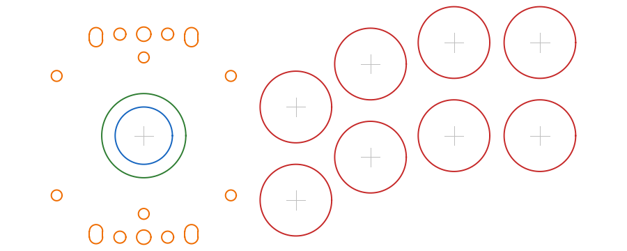 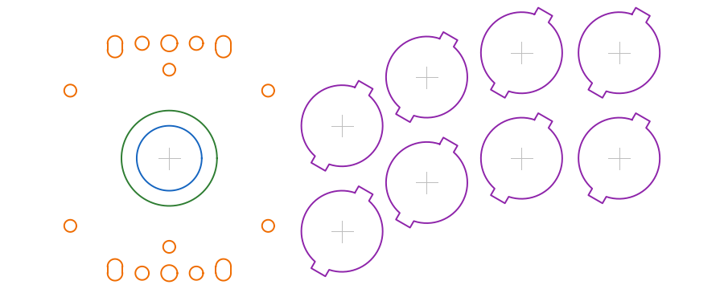

*Left: standard. Right: inner support, with the hole and its Sanwa OBSF ear relief merged into one profile.*

> Same as the previous layout, but space is added between rows.
>
> *Slagcoin*

Identical to `hori36_s` with the rows opened from 36 mm to 39 mm.

**8 buttons**  |  stock lever at **63.75 mm**  |  closest button pitch 36.0 mm at 30 mm, 28.8 mm at 24 mm  |  cut envelope 220 x 100 mm

More previews: [24 mm buttons](preview/horis36_s_24mm_buttons.png) &middot; [24 mm inner support](preview/inner_support_horis36_s_24mm_buttons.png)

| Version | 30 mm buttons | 24 mm buttons |
|---|---|---|
| Stock | [dxf](dxf/horis36_s.dxf) &middot; [svg](svg/horis36_s.svg) | [dxf](dxf/horis36_s_24mm_buttons.dxf) &middot; [svg](svg/horis36_s_24mm_buttons.svg) |
| Stock, inner support | [dxf](dxf/inner_support_horis36_s.dxf) &middot; [svg](svg/inner_support_horis36_s.svg) | [dxf](dxf/inner_support_horis36_s_24mm_buttons.dxf) &middot; [svg](svg/inner_support_horis36_s_24mm_buttons.svg) |
| 82 mm | [dxf](dxf/horis36_s_82mm_spacing.dxf) &middot; [svg](svg/horis36_s_82mm_spacing.svg) | [dxf](dxf/horis36_s_82mm_spacing_24mm_buttons.dxf) &middot; [svg](svg/horis36_s_82mm_spacing_24mm_buttons.svg) |
| 82 mm, inner support | [dxf](dxf/inner_support_horis36_s_82mm_spacing.dxf) &middot; [svg](svg/inner_support_horis36_s_82mm_spacing.svg) | [dxf](dxf/inner_support_horis36_s_82mm_spacing_24mm_buttons.dxf) &middot; [svg](svg/inner_support_horis36_s_82mm_spacing_24mm_buttons.svg) |
| 95 mm | [dxf](dxf/horis36_s_95mm_spacing.dxf) &middot; [svg](svg/horis36_s_95mm_spacing.svg) | [dxf](dxf/horis36_s_95mm_spacing_24mm_buttons.dxf) &middot; [svg](svg/horis36_s_95mm_spacing_24mm_buttons.svg) |
| 95 mm, inner support | [dxf](dxf/inner_support_horis36_s_95mm_spacing.dxf) &middot; [svg](svg/inner_support_horis36_s_95mm_spacing.svg) | [dxf](dxf/inner_support_horis36_s_95mm_spacing_24mm_buttons.dxf) &middot; [svg](svg/inner_support_horis36_s_95mm_spacing_24mm_buttons.svg) |


---

## Clustered arcade


### Clustered arcade

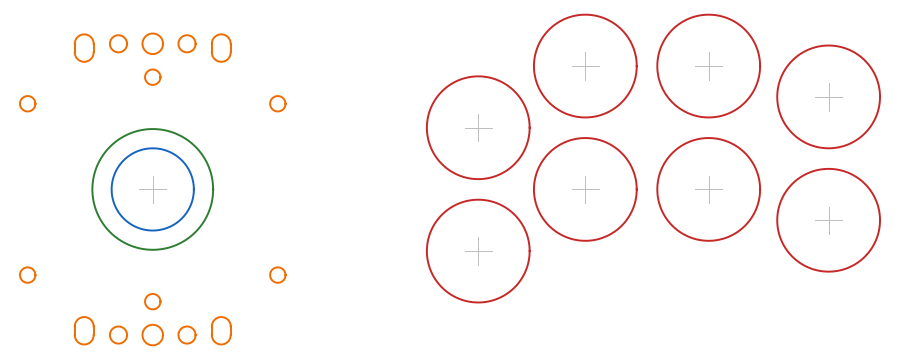 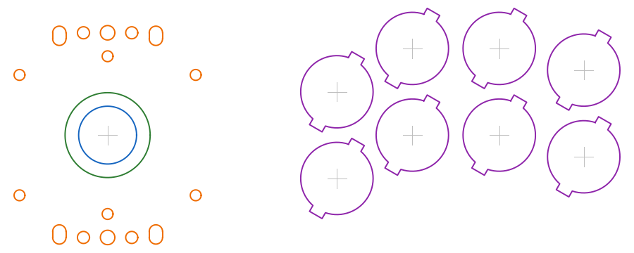

*Left: standard. Right: inner support, with the hole and its Sanwa OBSF ear relief merged into one profile.*

> This layout uses the standard Japanese arcade design, but the proportions are set so the buttons fit together more evenly and closely. The buttons form equilateral triangles and a square.
>
> *Slagcoin*

The Japanese arcade feel, but rationalised. The geometry is built out of equilateral triangles, so neighbouring buttons all sit a consistent 36 mm apart in every direction. This is the tightest and most packed of the slanted family.

**8 buttons**  |  stock lever at **95 mm**  |  closest button pitch 36.0 mm at 30 mm, 28.8 mm at 24 mm  |  cut envelope 251 x 96 mm

More previews: [24 mm buttons](preview/cluster36_s_24mm_buttons.png) &middot; [24 mm inner support](preview/inner_support_cluster36_s_24mm_buttons.png)

| Version | 30 mm buttons | 24 mm buttons |
|---|---|---|
| Stock | [dxf](dxf/cluster36_s.dxf) &middot; [svg](svg/cluster36_s.svg) | [dxf](dxf/cluster36_s_24mm_buttons.dxf) &middot; [svg](svg/cluster36_s_24mm_buttons.svg) |
| Stock, inner support | [dxf](dxf/inner_support_cluster36_s.dxf) &middot; [svg](svg/inner_support_cluster36_s.svg) | [dxf](dxf/inner_support_cluster36_s_24mm_buttons.dxf) &middot; [svg](svg/inner_support_cluster36_s_24mm_buttons.svg) |
| 82 mm | [dxf](dxf/cluster36_s_82mm_spacing.dxf) &middot; [svg](svg/cluster36_s_82mm_spacing.svg) | [dxf](dxf/cluster36_s_82mm_spacing_24mm_buttons.dxf) &middot; [svg](svg/cluster36_s_82mm_spacing_24mm_buttons.svg) |
| 82 mm, inner support | [dxf](dxf/inner_support_cluster36_s_82mm_spacing.dxf) &middot; [svg](svg/inner_support_cluster36_s_82mm_spacing.svg) | [dxf](dxf/inner_support_cluster36_s_82mm_spacing_24mm_buttons.dxf) &middot; [svg](svg/inner_support_cluster36_s_82mm_spacing_24mm_buttons.svg) |
| 95 mm | [dxf](dxf/cluster36_s_95mm_spacing.dxf) &middot; [svg](svg/cluster36_s_95mm_spacing.svg) | [dxf](dxf/cluster36_s_95mm_spacing_24mm_buttons.dxf) &middot; [svg](svg/cluster36_s_95mm_spacing_24mm_buttons.svg) |
| 95 mm, inner support | [dxf](dxf/inner_support_cluster36_s_95mm_spacing.dxf) &middot; [svg](svg/inner_support_cluster36_s_95mm_spacing.svg) | [dxf](dxf/inner_support_cluster36_s_95mm_spacing_24mm_buttons.dxf) &middot; [svg](svg/inner_support_cluster36_s_95mm_spacing_24mm_buttons.svg) |


### Clustered arcade, spaced rows

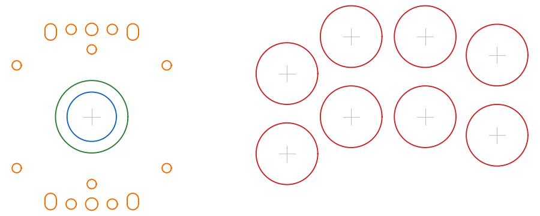 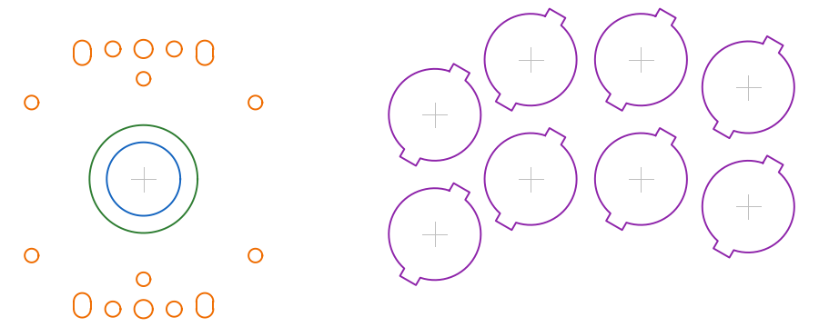

*Left: standard. Right: inner support, with the hole and its Sanwa OBSF ear relief merged into one profile.*

> Same as the previous layout, but space is added between the rows.
>
> *Slagcoin*

Identical to `cluster36_s` with the rows opened from 36 mm to 39 mm.

**8 buttons**  |  stock lever at **95 mm**  |  closest button pitch 36.0 mm at 30 mm, 28.8 mm at 24 mm  |  cut envelope 251 x 100 mm

More previews: [24 mm buttons](preview/clusters36_s_24mm_buttons.png) &middot; [24 mm inner support](preview/inner_support_clusters36_s_24mm_buttons.png)

| Version | 30 mm buttons | 24 mm buttons |
|---|---|---|
| Stock | [dxf](dxf/clusters36_s.dxf) &middot; [svg](svg/clusters36_s.svg) | [dxf](dxf/clusters36_s_24mm_buttons.dxf) &middot; [svg](svg/clusters36_s_24mm_buttons.svg) |
| Stock, inner support | [dxf](dxf/inner_support_clusters36_s.dxf) &middot; [svg](svg/inner_support_clusters36_s.svg) | [dxf](dxf/inner_support_clusters36_s_24mm_buttons.dxf) &middot; [svg](svg/inner_support_clusters36_s_24mm_buttons.svg) |
| 82 mm | [dxf](dxf/clusters36_s_82mm_spacing.dxf) &middot; [svg](svg/clusters36_s_82mm_spacing.svg) | [dxf](dxf/clusters36_s_82mm_spacing_24mm_buttons.dxf) &middot; [svg](svg/clusters36_s_82mm_spacing_24mm_buttons.svg) |
| 82 mm, inner support | [dxf](dxf/inner_support_clusters36_s_82mm_spacing.dxf) &middot; [svg](svg/inner_support_clusters36_s_82mm_spacing.svg) | [dxf](dxf/inner_support_clusters36_s_82mm_spacing_24mm_buttons.dxf) &middot; [svg](svg/inner_support_clusters36_s_82mm_spacing_24mm_buttons.svg) |
| 95 mm | [dxf](dxf/clusters36_s_95mm_spacing.dxf) &middot; [svg](svg/clusters36_s_95mm_spacing.svg) | [dxf](dxf/clusters36_s_95mm_spacing_24mm_buttons.dxf) &middot; [svg](svg/clusters36_s_95mm_spacing_24mm_buttons.svg) |
| 95 mm, inner support | [dxf](dxf/inner_support_clusters36_s_95mm_spacing.dxf) &middot; [svg](svg/inner_support_clusters36_s_95mm_spacing.svg) | [dxf](dxf/inner_support_clusters36_s_95mm_spacing_24mm_buttons.dxf) &middot; [svg](svg/inner_support_clusters36_s_95mm_spacing_24mm_buttons.svg) |


---

## Direct slant


### Direct slant

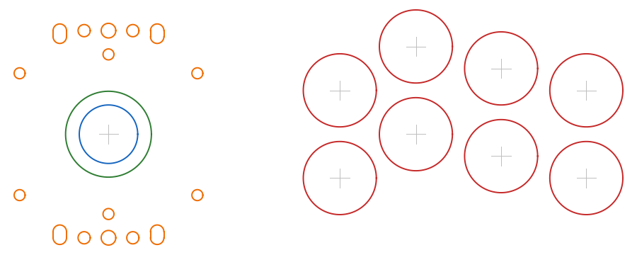 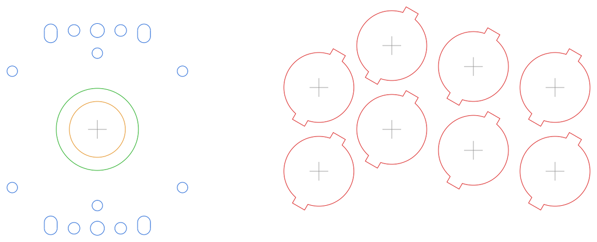

*Left: standard. Right: inner support, with the hole and its Sanwa OBSF ear relief merged into one profile.*

> The layout does a direct build of the slanted layout. It uses half-steps like those in the Hori layout.
>
> *Slagcoin*

A clean, deliberate arch. It climbs to the middle finger column and then comes back down in half steps for the ring and pinky, which follows where your fingertips actually land. The half steps keep it from feeling as steep as the incline layouts.

**8 buttons**  |  stock lever at **95 mm**  |  closest button pitch 36.0 mm at 30 mm, 28.8 mm at 24 mm  |  cut envelope 250 x 96 mm

More previews: [24 mm buttons](preview/slant36_s_24mm_buttons.png) &middot; [24 mm inner support](preview/inner_support_slant36_s_24mm_buttons.png)

| Version | 30 mm buttons | 24 mm buttons |
|---|---|---|
| Stock | [dxf](dxf/slant36_s.dxf) &middot; [svg](svg/slant36_s.svg) | [dxf](dxf/slant36_s_24mm_buttons.dxf) &middot; [svg](svg/slant36_s_24mm_buttons.svg) |
| Stock, inner support | [dxf](dxf/inner_support_slant36_s.dxf) &middot; [svg](svg/inner_support_slant36_s.svg) | [dxf](dxf/inner_support_slant36_s_24mm_buttons.dxf) &middot; [svg](svg/inner_support_slant36_s_24mm_buttons.svg) |
| 82 mm | [dxf](dxf/slant36_s_82mm_spacing.dxf) &middot; [svg](svg/slant36_s_82mm_spacing.svg) | [dxf](dxf/slant36_s_82mm_spacing_24mm_buttons.dxf) &middot; [svg](svg/slant36_s_82mm_spacing_24mm_buttons.svg) |
| 82 mm, inner support | [dxf](dxf/inner_support_slant36_s_82mm_spacing.dxf) &middot; [svg](svg/inner_support_slant36_s_82mm_spacing.svg) | [dxf](dxf/inner_support_slant36_s_82mm_spacing_24mm_buttons.dxf) &middot; [svg](svg/inner_support_slant36_s_82mm_spacing_24mm_buttons.svg) |
| 95 mm | [dxf](dxf/slant36_s_95mm_spacing.dxf) &middot; [svg](svg/slant36_s_95mm_spacing.svg) | [dxf](dxf/slant36_s_95mm_spacing_24mm_buttons.dxf) &middot; [svg](svg/slant36_s_95mm_spacing_24mm_buttons.svg) |
| 95 mm, inner support | [dxf](dxf/inner_support_slant36_s_95mm_spacing.dxf) &middot; [svg](svg/inner_support_slant36_s_95mm_spacing.svg) | [dxf](dxf/inner_support_slant36_s_95mm_spacing_24mm_buttons.dxf) &middot; [svg](svg/inner_support_slant36_s_95mm_spacing_24mm_buttons.svg) |


### Direct slant, spaced rows

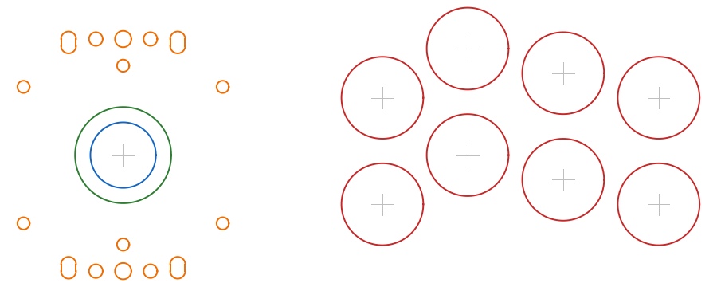 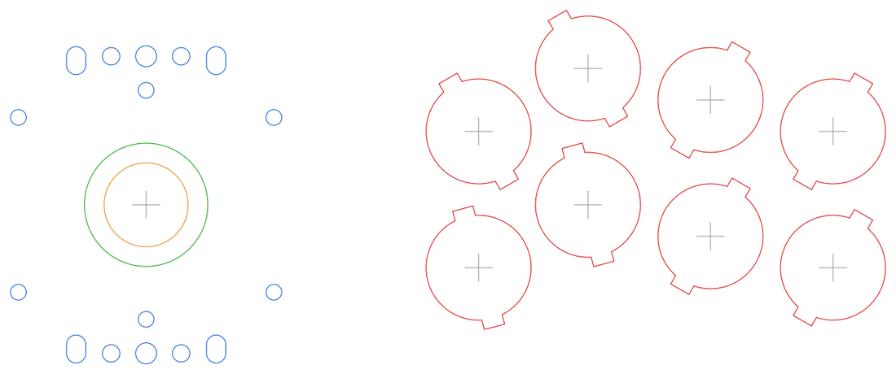

*Left: standard. Right: inner support, with the hole and its Sanwa OBSF ear relief merged into one profile.*

> Same as the previous layout, but space is added between rows.
>
> *Slagcoin*

Identical to `slant36_s` with the rows opened from 36 mm to 39 mm.

**8 buttons**  |  stock lever at **95 mm**  |  closest button pitch 36.1 mm at 30 mm, 28.9 mm at 24 mm  |  cut envelope 250 x 100 mm

More previews: [24 mm buttons](preview/slants36_s_24mm_buttons.png) &middot; [24 mm inner support](preview/inner_support_slants36_s_24mm_buttons.png)

| Version | 30 mm buttons | 24 mm buttons |
|---|---|---|
| Stock | [dxf](dxf/slants36_s.dxf) &middot; [svg](svg/slants36_s.svg) | [dxf](dxf/slants36_s_24mm_buttons.dxf) &middot; [svg](svg/slants36_s_24mm_buttons.svg) |
| Stock, inner support | [dxf](dxf/inner_support_slants36_s.dxf) &middot; [svg](svg/inner_support_slants36_s.svg) | [dxf](dxf/inner_support_slants36_s_24mm_buttons.dxf) &middot; [svg](svg/inner_support_slants36_s_24mm_buttons.svg) |
| 82 mm | [dxf](dxf/slants36_s_82mm_spacing.dxf) &middot; [svg](svg/slants36_s_82mm_spacing.svg) | [dxf](dxf/slants36_s_82mm_spacing_24mm_buttons.dxf) &middot; [svg](svg/slants36_s_82mm_spacing_24mm_buttons.svg) |
| 82 mm, inner support | [dxf](dxf/inner_support_slants36_s_82mm_spacing.dxf) &middot; [svg](svg/inner_support_slants36_s_82mm_spacing.svg) | [dxf](dxf/inner_support_slants36_s_82mm_spacing_24mm_buttons.dxf) &middot; [svg](svg/inner_support_slants36_s_82mm_spacing_24mm_buttons.svg) |
| 95 mm | [dxf](dxf/slants36_s_95mm_spacing.dxf) &middot; [svg](svg/slants36_s_95mm_spacing.svg) | [dxf](dxf/slants36_s_95mm_spacing_24mm_buttons.dxf) &middot; [svg](svg/slants36_s_95mm_spacing_24mm_buttons.svg) |
| 95 mm, inner support | [dxf](dxf/inner_support_slants36_s_95mm_spacing.dxf) &middot; [svg](svg/inner_support_slants36_s_95mm_spacing.svg) | [dxf](dxf/inner_support_slants36_s_95mm_spacing_24mm_buttons.dxf) &middot; [svg](svg/inner_support_slants36_s_95mm_spacing_24mm_buttons.svg) |


---

## Moderate and hybrid


### Moderate / hybrid

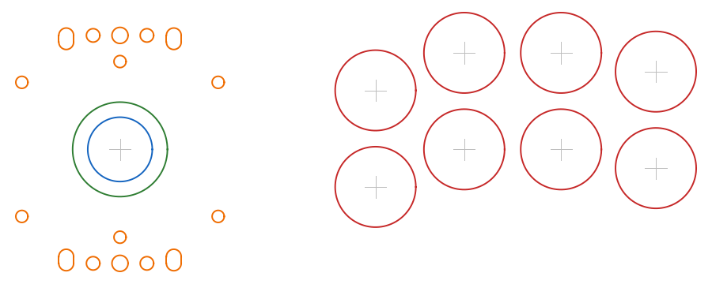 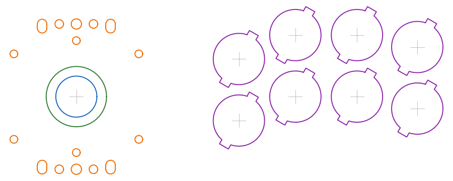

*Left: standard. Right: inner support, with the hole and its Sanwa OBSF ear relief merged into one profile.*

> This layout is somewhat of a mix between the standard player 1 and player 2 layouts. The curvature is not as defined.
>
> *Slagcoin*

Halfway between the slanted P1 and the flat P2. A gentle step up on the index column, flat through the middle, and a small drop for the pinky.

**A good default if you cannot decide.** It is forgiving of a lot of hand shapes without committing hard to a slant.

**8 buttons**  |  stock lever at **95 mm**  |  closest button pitch 35.8 mm at 30 mm, 28.7 mm at 24 mm  |  cut envelope 253 x 96 mm

More previews: [24 mm buttons](preview/hybrid36_s_24mm_buttons.png) &middot; [24 mm inner support](preview/inner_support_hybrid36_s_24mm_buttons.png)

| Version | 30 mm buttons | 24 mm buttons |
|---|---|---|
| Stock | [dxf](dxf/hybrid36_s.dxf) &middot; [svg](svg/hybrid36_s.svg) | [dxf](dxf/hybrid36_s_24mm_buttons.dxf) &middot; [svg](svg/hybrid36_s_24mm_buttons.svg) |
| Stock, inner support | [dxf](dxf/inner_support_hybrid36_s.dxf) &middot; [svg](svg/inner_support_hybrid36_s.svg) | [dxf](dxf/inner_support_hybrid36_s_24mm_buttons.dxf) &middot; [svg](svg/inner_support_hybrid36_s_24mm_buttons.svg) |
| 82 mm | [dxf](dxf/hybrid36_s_82mm_spacing.dxf) &middot; [svg](svg/hybrid36_s_82mm_spacing.svg) | [dxf](dxf/hybrid36_s_82mm_spacing_24mm_buttons.dxf) &middot; [svg](svg/hybrid36_s_82mm_spacing_24mm_buttons.svg) |
| 82 mm, inner support | [dxf](dxf/inner_support_hybrid36_s_82mm_spacing.dxf) &middot; [svg](svg/inner_support_hybrid36_s_82mm_spacing.svg) | [dxf](dxf/inner_support_hybrid36_s_82mm_spacing_24mm_buttons.dxf) &middot; [svg](svg/inner_support_hybrid36_s_82mm_spacing_24mm_buttons.svg) |
| 95 mm | [dxf](dxf/hybrid36_s_95mm_spacing.dxf) &middot; [svg](svg/hybrid36_s_95mm_spacing.svg) | [dxf](dxf/hybrid36_s_95mm_spacing_24mm_buttons.dxf) &middot; [svg](svg/hybrid36_s_95mm_spacing_24mm_buttons.svg) |
| 95 mm, inner support | [dxf](dxf/inner_support_hybrid36_s_95mm_spacing.dxf) &middot; [svg](svg/inner_support_hybrid36_s_95mm_spacing.svg) | [dxf](dxf/inner_support_hybrid36_s_95mm_spacing_24mm_buttons.dxf) &middot; [svg](svg/inner_support_hybrid36_s_95mm_spacing_24mm_buttons.svg) |


### Moderate / hybrid, spaced rows

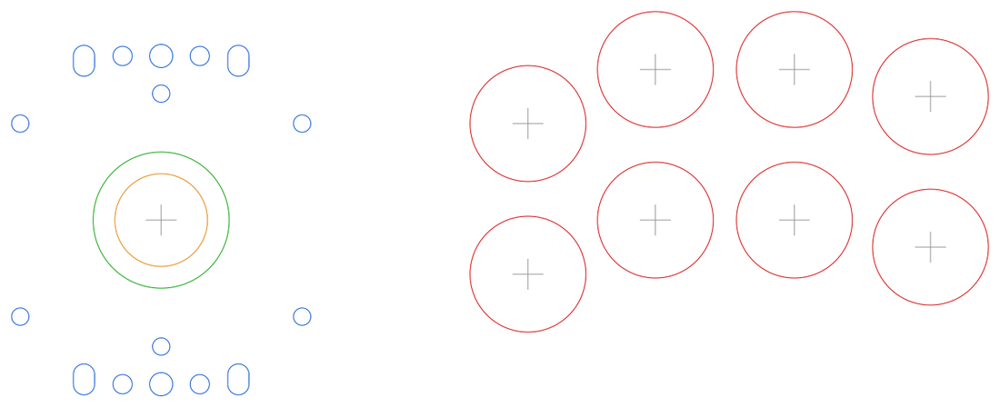 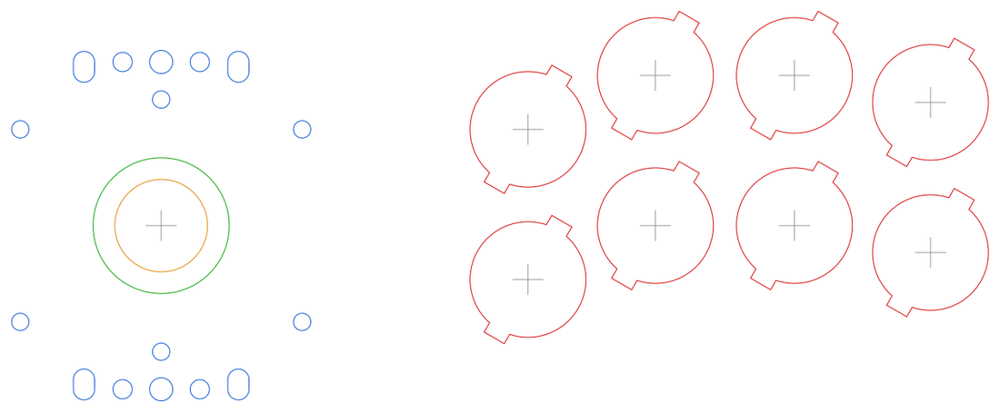

*Left: standard. Right: inner support, with the hole and its Sanwa OBSF ear relief merged into one profile.*

> Same as the previous layout, but space is added between rows.
>
> *Slagcoin*

Identical to `hybrid36_s` with the rows opened from 36 mm to 39 mm.

**8 buttons**  |  stock lever at **95 mm**  |  closest button pitch 35.8 mm at 30 mm, 28.7 mm at 24 mm  |  cut envelope 253 x 100 mm

More previews: [24 mm buttons](preview/hybrids36_s_24mm_buttons.png) &middot; [24 mm inner support](preview/inner_support_hybrids36_s_24mm_buttons.png)

| Version | 30 mm buttons | 24 mm buttons |
|---|---|---|
| Stock | [dxf](dxf/hybrids36_s.dxf) &middot; [svg](svg/hybrids36_s.svg) | [dxf](dxf/hybrids36_s_24mm_buttons.dxf) &middot; [svg](svg/hybrids36_s_24mm_buttons.svg) |
| Stock, inner support | [dxf](dxf/inner_support_hybrids36_s.dxf) &middot; [svg](svg/inner_support_hybrids36_s.svg) | [dxf](dxf/inner_support_hybrids36_s_24mm_buttons.dxf) &middot; [svg](svg/inner_support_hybrids36_s_24mm_buttons.svg) |
| 82 mm | [dxf](dxf/hybrids36_s_82mm_spacing.dxf) &middot; [svg](svg/hybrids36_s_82mm_spacing.svg) | [dxf](dxf/hybrids36_s_82mm_spacing_24mm_buttons.dxf) &middot; [svg](svg/hybrids36_s_82mm_spacing_24mm_buttons.svg) |
| 82 mm, inner support | [dxf](dxf/inner_support_hybrids36_s_82mm_spacing.dxf) &middot; [svg](svg/inner_support_hybrids36_s_82mm_spacing.svg) | [dxf](dxf/inner_support_hybrids36_s_82mm_spacing_24mm_buttons.dxf) &middot; [svg](svg/inner_support_hybrids36_s_82mm_spacing_24mm_buttons.svg) |
| 95 mm | [dxf](dxf/hybrids36_s_95mm_spacing.dxf) &middot; [svg](svg/hybrids36_s_95mm_spacing.svg) | [dxf](dxf/hybrids36_s_95mm_spacing_24mm_buttons.dxf) &middot; [svg](svg/hybrids36_s_95mm_spacing_24mm_buttons.svg) |
| 95 mm, inner support | [dxf](dxf/inner_support_hybrids36_s_95mm_spacing.dxf) &middot; [svg](svg/inner_support_hybrids36_s_95mm_spacing.svg) | [dxf](dxf/inner_support_hybrids36_s_95mm_spacing_24mm_buttons.dxf) &middot; [svg](svg/inner_support_hybrids36_s_95mm_spacing_24mm_buttons.svg) |


---

## Straight incline


### Straight incline

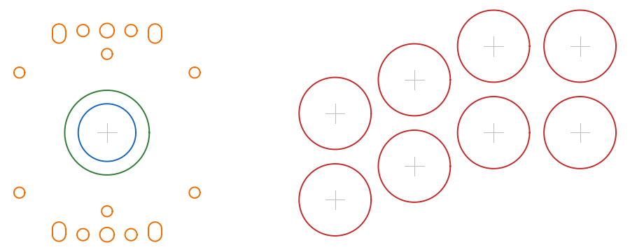 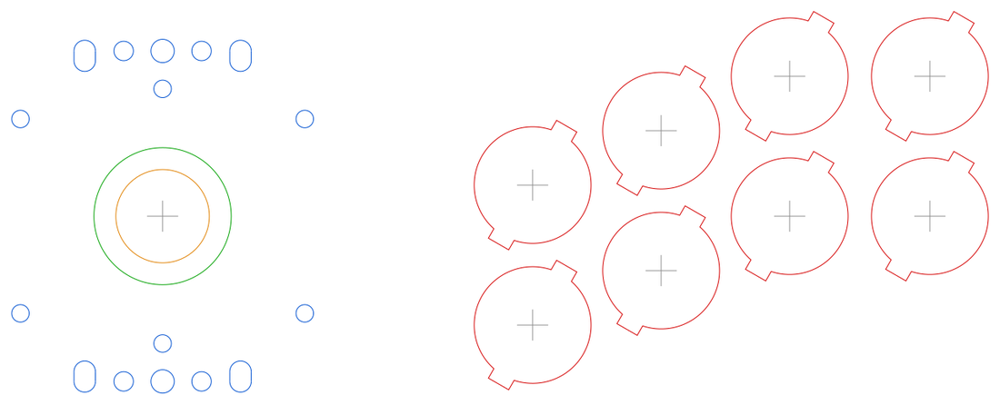

*Left: standard. Right: inner support, with the hole and its Sanwa OBSF ear relief merged into one profile.*

> This layout inclines straight until the pinky buttons.
>
> *Slagcoin*

The most aggressive slant in the set. It climbs steadily column by column and then levels off for the pinky. If you play with a strongly angled hand, or your ring and pinky sit noticeably lower than your index finger, this is the one worth printing and feeling before anything else.

**8 buttons**  |  stock lever at **95 mm**  |  closest button pitch 35.8 mm at 30 mm, 28.7 mm at 24 mm  |  cut envelope 251 x 96 mm

More previews: [24 mm buttons](preview/incline36_s_24mm_buttons.png) &middot; [24 mm inner support](preview/inner_support_incline36_s_24mm_buttons.png)

| Version | 30 mm buttons | 24 mm buttons |
|---|---|---|
| Stock | [dxf](dxf/incline36_s.dxf) &middot; [svg](svg/incline36_s.svg) | [dxf](dxf/incline36_s_24mm_buttons.dxf) &middot; [svg](svg/incline36_s_24mm_buttons.svg) |
| Stock, inner support | [dxf](dxf/inner_support_incline36_s.dxf) &middot; [svg](svg/inner_support_incline36_s.svg) | [dxf](dxf/inner_support_incline36_s_24mm_buttons.dxf) &middot; [svg](svg/inner_support_incline36_s_24mm_buttons.svg) |
| 82 mm | [dxf](dxf/incline36_s_82mm_spacing.dxf) &middot; [svg](svg/incline36_s_82mm_spacing.svg) | [dxf](dxf/incline36_s_82mm_spacing_24mm_buttons.dxf) &middot; [svg](svg/incline36_s_82mm_spacing_24mm_buttons.svg) |
| 82 mm, inner support | [dxf](dxf/inner_support_incline36_s_82mm_spacing.dxf) &middot; [svg](svg/inner_support_incline36_s_82mm_spacing.svg) | [dxf](dxf/inner_support_incline36_s_82mm_spacing_24mm_buttons.dxf) &middot; [svg](svg/inner_support_incline36_s_82mm_spacing_24mm_buttons.svg) |
| 95 mm | [dxf](dxf/incline36_s_95mm_spacing.dxf) &middot; [svg](svg/incline36_s_95mm_spacing.svg) | [dxf](dxf/incline36_s_95mm_spacing_24mm_buttons.dxf) &middot; [svg](svg/incline36_s_95mm_spacing_24mm_buttons.svg) |
| 95 mm, inner support | [dxf](dxf/inner_support_incline36_s_95mm_spacing.dxf) &middot; [svg](svg/inner_support_incline36_s_95mm_spacing.svg) | [dxf](dxf/inner_support_incline36_s_95mm_spacing_24mm_buttons.dxf) &middot; [svg](svg/inner_support_incline36_s_95mm_spacing_24mm_buttons.svg) |


### Straight incline, spaced rows

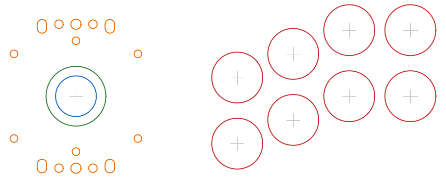 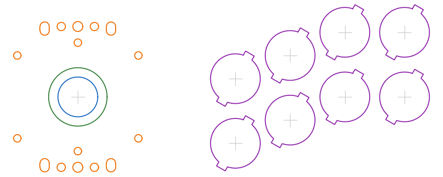

*Left: standard. Right: inner support, with the hole and its Sanwa OBSF ear relief merged into one profile.*

> Same as the previous layout, but space is added between rows.
>
> *Slagcoin*

Identical to `incline36_s` with the rows opened from 36 mm to 39 mm.

**8 buttons**  |  stock lever at **95 mm**  |  closest button pitch 35.8 mm at 30 mm, 28.7 mm at 24 mm  |  cut envelope 251 x 100 mm

More previews: [24 mm buttons](preview/inclines36_s_24mm_buttons.png) &middot; [24 mm inner support](preview/inner_support_inclines36_s_24mm_buttons.png)

| Version | 30 mm buttons | 24 mm buttons |
|---|---|---|
| Stock | [dxf](dxf/inclines36_s.dxf) &middot; [svg](svg/inclines36_s.svg) | [dxf](dxf/inclines36_s_24mm_buttons.dxf) &middot; [svg](svg/inclines36_s_24mm_buttons.svg) |
| Stock, inner support | [dxf](dxf/inner_support_inclines36_s.dxf) &middot; [svg](svg/inner_support_inclines36_s.svg) | [dxf](dxf/inner_support_inclines36_s_24mm_buttons.dxf) &middot; [svg](svg/inner_support_inclines36_s_24mm_buttons.svg) |
| 82 mm | [dxf](dxf/inclines36_s_82mm_spacing.dxf) &middot; [svg](svg/inclines36_s_82mm_spacing.svg) | [dxf](dxf/inclines36_s_82mm_spacing_24mm_buttons.dxf) &middot; [svg](svg/inclines36_s_82mm_spacing_24mm_buttons.svg) |
| 82 mm, inner support | [dxf](dxf/inner_support_inclines36_s_82mm_spacing.dxf) &middot; [svg](svg/inner_support_inclines36_s_82mm_spacing.svg) | [dxf](dxf/inner_support_inclines36_s_82mm_spacing_24mm_buttons.dxf) &middot; [svg](svg/inner_support_inclines36_s_82mm_spacing_24mm_buttons.svg) |
| 95 mm | [dxf](dxf/inclines36_s_95mm_spacing.dxf) &middot; [svg](svg/inclines36_s_95mm_spacing.svg) | [dxf](dxf/inclines36_s_95mm_spacing_24mm_buttons.dxf) &middot; [svg](svg/inclines36_s_95mm_spacing_24mm_buttons.svg) |
| 95 mm, inner support | [dxf](dxf/inner_support_inclines36_s_95mm_spacing.dxf) &middot; [svg](svg/inner_support_inclines36_s_95mm_spacing.svg) | [dxf](dxf/inner_support_inclines36_s_95mm_spacing_24mm_buttons.dxf) &middot; [svg](svg/inner_support_inclines36_s_95mm_spacing_24mm_buttons.svg) |


---

## Grids and squares

Slagcoin is openly not a fan of these, but they are historically important and some people genuinely like them.


### Square grid

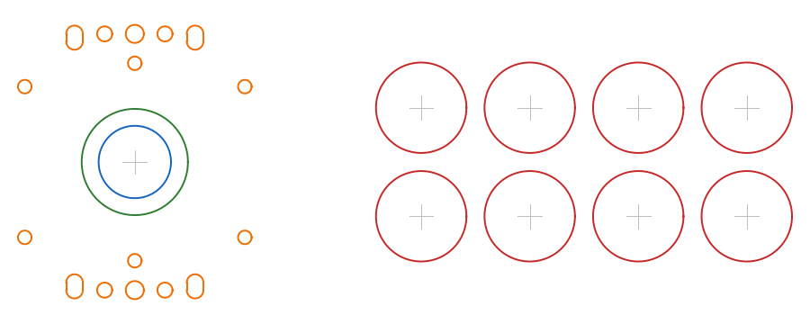 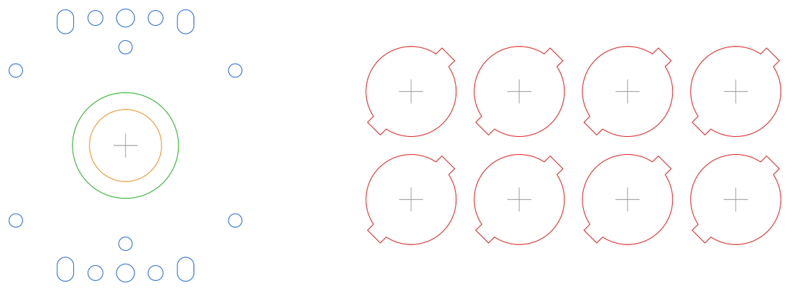

*Left: standard. Right: inner support, with the hole and its Sanwa OBSF ear relief merged into one profile.*

> This is a clustered grid layout. It has more of an appropriate spacing, but the squareness still does not suit the human hand very well. Additional dots are there for making a Neo Geo layout which is more appropriate for the human hand.
>
> *Slagcoin*

A perfectly square 4 by 2 grid on a 36 mm pitch. Dead simple to drill, dead simple to explain, and the usual starting point for a Neo Geo arrangement.

**8 buttons**  |  stock lever at **95 mm**  |  closest button pitch 36.0 mm at 30 mm, 28.8 mm at 24 mm  |  cut envelope 257 x 91 mm

More previews: [24 mm buttons](preview/matrix36_s_24mm_buttons.png) &middot; [24 mm inner support](preview/inner_support_matrix36_s_24mm_buttons.png)

| Version | 30 mm buttons | 24 mm buttons |
|---|---|---|
| Stock | [dxf](dxf/matrix36_s.dxf) &middot; [svg](svg/matrix36_s.svg) | [dxf](dxf/matrix36_s_24mm_buttons.dxf) &middot; [svg](svg/matrix36_s_24mm_buttons.svg) |
| Stock, inner support | [dxf](dxf/inner_support_matrix36_s.dxf) &middot; [svg](svg/inner_support_matrix36_s.svg) | [dxf](dxf/inner_support_matrix36_s_24mm_buttons.dxf) &middot; [svg](svg/inner_support_matrix36_s_24mm_buttons.svg) |
| 82 mm | [dxf](dxf/matrix36_s_82mm_spacing.dxf) &middot; [svg](svg/matrix36_s_82mm_spacing.svg) | [dxf](dxf/matrix36_s_82mm_spacing_24mm_buttons.dxf) &middot; [svg](svg/matrix36_s_82mm_spacing_24mm_buttons.svg) |
| 82 mm, inner support | [dxf](dxf/inner_support_matrix36_s_82mm_spacing.dxf) &middot; [svg](svg/inner_support_matrix36_s_82mm_spacing.svg) | [dxf](dxf/inner_support_matrix36_s_82mm_spacing_24mm_buttons.dxf) &middot; [svg](svg/inner_support_matrix36_s_82mm_spacing_24mm_buttons.svg) |
| 95 mm | [dxf](dxf/matrix36_s_95mm_spacing.dxf) &middot; [svg](svg/matrix36_s_95mm_spacing.svg) | [dxf](dxf/matrix36_s_95mm_spacing_24mm_buttons.dxf) &middot; [svg](svg/matrix36_s_95mm_spacing_24mm_buttons.svg) |
| 95 mm, inner support | [dxf](dxf/inner_support_matrix36_s_95mm_spacing.dxf) &middot; [svg](svg/inner_support_matrix36_s_95mm_spacing.svg) | [dxf](dxf/inner_support_matrix36_s_95mm_spacing_24mm_buttons.dxf) &middot; [svg](svg/inner_support_matrix36_s_95mm_spacing_24mm_buttons.svg) |


### Square grid, spaced rows

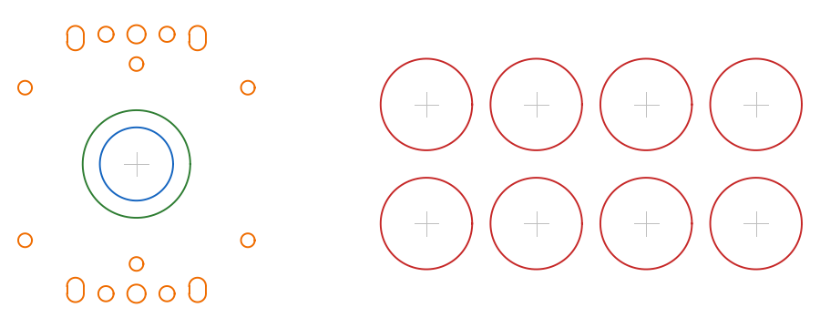 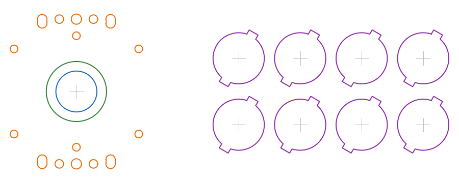

*Left: standard. Right: inner support, with the hole and its Sanwa OBSF ear relief merged into one profile.*

> Same as the previous layout, but space is added between the rows.
>
> *Slagcoin*

Identical to `matrix36_s` with the rows opened from 36 mm to 39 mm.

**8 buttons**  |  stock lever at **95 mm**  |  closest button pitch 36.0 mm at 30 mm, 28.8 mm at 24 mm  |  cut envelope 257 x 91 mm

More previews: [24 mm buttons](preview/matrixs36_s_24mm_buttons.png) &middot; [24 mm inner support](preview/inner_support_matrixs36_s_24mm_buttons.png)

| Version | 30 mm buttons | 24 mm buttons |
|---|---|---|
| Stock | [dxf](dxf/matrixs36_s.dxf) &middot; [svg](svg/matrixs36_s.svg) | [dxf](dxf/matrixs36_s_24mm_buttons.dxf) &middot; [svg](svg/matrixs36_s_24mm_buttons.svg) |
| Stock, inner support | [dxf](dxf/inner_support_matrixs36_s.dxf) &middot; [svg](svg/inner_support_matrixs36_s.svg) | [dxf](dxf/inner_support_matrixs36_s_24mm_buttons.dxf) &middot; [svg](svg/inner_support_matrixs36_s_24mm_buttons.svg) |
| 82 mm | [dxf](dxf/matrixs36_s_82mm_spacing.dxf) &middot; [svg](svg/matrixs36_s_82mm_spacing.svg) | [dxf](dxf/matrixs36_s_82mm_spacing_24mm_buttons.dxf) &middot; [svg](svg/matrixs36_s_82mm_spacing_24mm_buttons.svg) |
| 82 mm, inner support | [dxf](dxf/inner_support_matrixs36_s_82mm_spacing.dxf) &middot; [svg](svg/inner_support_matrixs36_s_82mm_spacing.svg) | [dxf](dxf/inner_support_matrixs36_s_82mm_spacing_24mm_buttons.dxf) &middot; [svg](svg/inner_support_matrixs36_s_82mm_spacing_24mm_buttons.svg) |
| 95 mm | [dxf](dxf/matrixs36_s_95mm_spacing.dxf) &middot; [svg](svg/matrixs36_s_95mm_spacing.svg) | [dxf](dxf/matrixs36_s_95mm_spacing_24mm_buttons.dxf) &middot; [svg](svg/matrixs36_s_95mm_spacing_24mm_buttons.svg) |
| 95 mm, inner support | [dxf](dxf/inner_support_matrixs36_s_95mm_spacing.dxf) &middot; [svg](svg/inner_support_matrixs36_s_95mm_spacing.svg) | [dxf](dxf/inner_support_matrixs36_s_95mm_spacing_24mm_buttons.dxf) &middot; [svg](svg/inner_support_matrixs36_s_95mm_spacing_24mm_buttons.svg) |


### Capcom USA Street Fighter

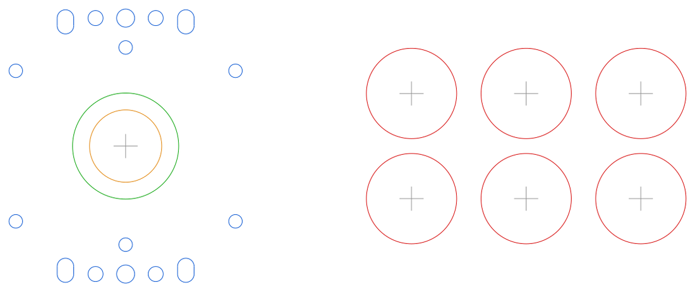 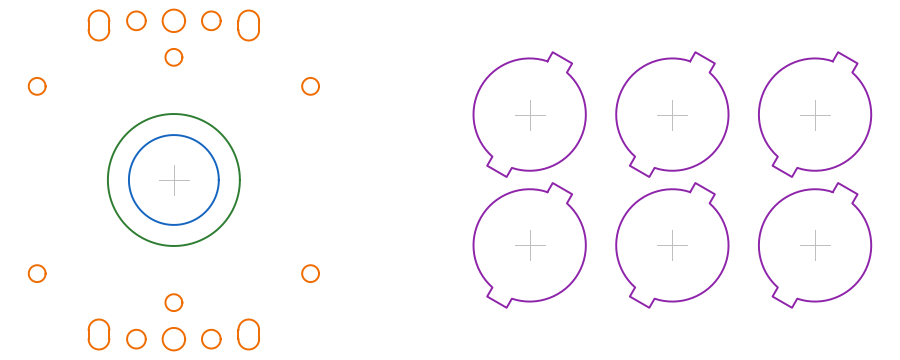

*Left: standard. Right: inner support, with the hole and its Sanwa OBSF ear relief merged into one profile.*

> This is the American Street Fighter layout given by Capcom USA. It has some strange wide-spacing and does not suit the structure of the human hand. I do not advocate squared layouts like this one and others.
>
> *Slagcoin*

The classic US cab 6 button block. This is the only layout in the set that was dimensioned in inches rather than millimetres, an inch and a half between columns and an inch and three eighths between rows, so the metric numbers look odd because they are exact conversions rather than rounded values.

Slagcoin does not recommend it. It is here because it is history, and because if you are restoring an American cabinet you need it to be right.

**6 buttons**  |  stock lever at **95 mm**  |  closest button pitch 34.9 mm at 30 mm, 27.9 mm at 24 mm  |  cut envelope 225 x 91 mm

More previews: [24 mm buttons](preview/american_s_24mm_buttons.png) &middot; [24 mm inner support](preview/inner_support_american_s_24mm_buttons.png)

| Version | 30 mm buttons | 24 mm buttons |
|---|---|---|
| Stock | [dxf](dxf/american_s.dxf) &middot; [svg](svg/american_s.svg) | [dxf](dxf/american_s_24mm_buttons.dxf) &middot; [svg](svg/american_s_24mm_buttons.svg) |
| Stock, inner support | [dxf](dxf/inner_support_american_s.dxf) &middot; [svg](svg/inner_support_american_s.svg) | [dxf](dxf/inner_support_american_s_24mm_buttons.dxf) &middot; [svg](svg/inner_support_american_s_24mm_buttons.svg) |
| 82 mm | [dxf](dxf/american_s_82mm_spacing.dxf) &middot; [svg](svg/american_s_82mm_spacing.svg) | [dxf](dxf/american_s_82mm_spacing_24mm_buttons.dxf) &middot; [svg](svg/american_s_82mm_spacing_24mm_buttons.svg) |
| 82 mm, inner support | [dxf](dxf/inner_support_american_s_82mm_spacing.dxf) &middot; [svg](svg/inner_support_american_s_82mm_spacing.svg) | [dxf](dxf/inner_support_american_s_82mm_spacing_24mm_buttons.dxf) &middot; [svg](svg/inner_support_american_s_82mm_spacing_24mm_buttons.svg) |
| 95 mm | [dxf](dxf/american_s_95mm_spacing.dxf) &middot; [svg](svg/american_s_95mm_spacing.svg) | [dxf](dxf/american_s_95mm_spacing_24mm_buttons.dxf) &middot; [svg](svg/american_s_95mm_spacing_24mm_buttons.svg) |
| 95 mm, inner support | [dxf](dxf/inner_support_american_s_95mm_spacing.dxf) &middot; [svg](svg/inner_support_american_s_95mm_spacing.svg) | [dxf](dxf/inner_support_american_s_95mm_spacing_24mm_buttons.dxf) &middot; [svg](svg/inner_support_american_s_95mm_spacing_24mm_buttons.svg) |


---

## Templates

These are not layouts to cut as they are. They are grids of candidate positions on a consistent 36 mm pitch. Cut only the holes you want, or use them to design something custom. They carry the most holes of anything in the repository, so read them as a menu rather than a finished panel.


### Mesh template

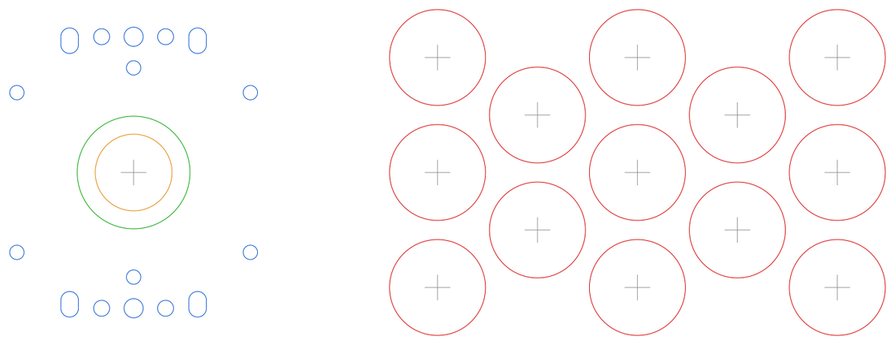 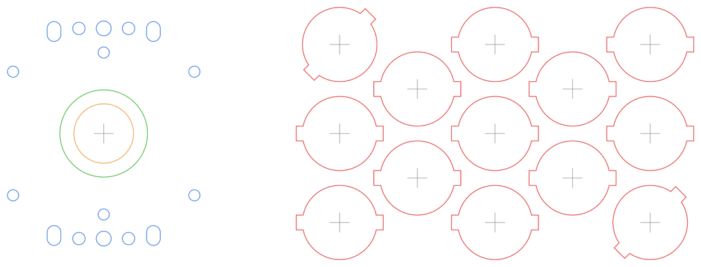

*Left: standard. Right: inner support, with the hole and its Sanwa OBSF ear relief merged into one profile.*

> Mesh template from which various layouts can be made.
>
> *Slagcoin*

A honeycomb style offset grid. Columns alternate between three high and two high, and everything sits a consistent 36 mm from its neighbours. Almost any slanted or arched layout can be carved out of this one.

**13 buttons**  |  stock lever at **95 mm**  |  closest button pitch 36.0 mm at 30 mm, 28.8 mm at 24 mm  |  cut envelope 274 x 102 mm

More previews: [24 mm buttons](preview/mesh36_s_24mm_buttons.png) &middot; [24 mm inner support](preview/inner_support_mesh36_s_24mm_buttons.png)

| Version | 30 mm buttons | 24 mm buttons |
|---|---|---|
| Stock | [dxf](dxf/mesh36_s.dxf) &middot; [svg](svg/mesh36_s.svg) | [dxf](dxf/mesh36_s_24mm_buttons.dxf) &middot; [svg](svg/mesh36_s_24mm_buttons.svg) |
| Stock, inner support | [dxf](dxf/inner_support_mesh36_s.dxf) &middot; [svg](svg/inner_support_mesh36_s.svg) | [dxf](dxf/inner_support_mesh36_s_24mm_buttons.dxf) &middot; [svg](svg/inner_support_mesh36_s_24mm_buttons.svg) |
| 82 mm | [dxf](dxf/mesh36_s_82mm_spacing.dxf) &middot; [svg](svg/mesh36_s_82mm_spacing.svg) | [dxf](dxf/mesh36_s_82mm_spacing_24mm_buttons.dxf) &middot; [svg](svg/mesh36_s_82mm_spacing_24mm_buttons.svg) |
| 82 mm, inner support | [dxf](dxf/inner_support_mesh36_s_82mm_spacing.dxf) &middot; [svg](svg/inner_support_mesh36_s_82mm_spacing.svg) | [dxf](dxf/inner_support_mesh36_s_82mm_spacing_24mm_buttons.dxf) &middot; [svg](svg/inner_support_mesh36_s_82mm_spacing_24mm_buttons.svg) |
| 95 mm | [dxf](dxf/mesh36_s_95mm_spacing.dxf) &middot; [svg](svg/mesh36_s_95mm_spacing.svg) | [dxf](dxf/mesh36_s_95mm_spacing_24mm_buttons.dxf) &middot; [svg](svg/mesh36_s_95mm_spacing_24mm_buttons.svg) |
| 95 mm, inner support | [dxf](dxf/inner_support_mesh36_s_95mm_spacing.dxf) &middot; [svg](svg/inner_support_mesh36_s_95mm_spacing.svg) | [dxf](dxf/inner_support_mesh36_s_95mm_spacing_24mm_buttons.dxf) &middot; [svg](svg/inner_support_mesh36_s_95mm_spacing_24mm_buttons.svg) |


### Rhombus template

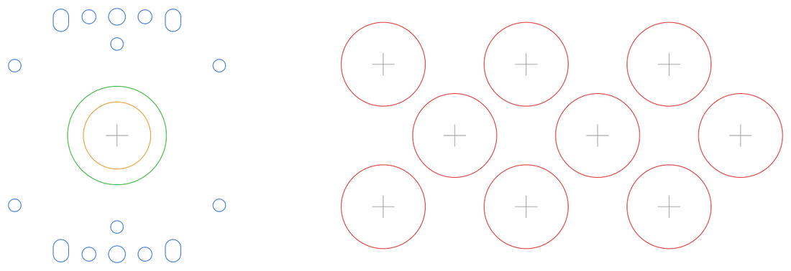 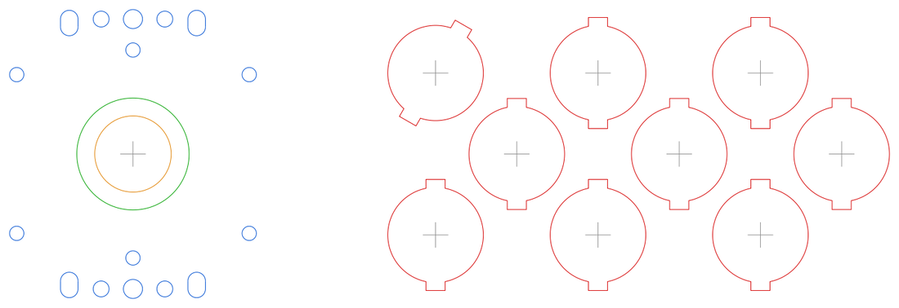

*Left: standard. Right: inner support, with the hole and its Sanwa OBSF ear relief merged into one profile.*

> Diagonal square template from which various layouts can be made.
>
> *Slagcoin*

A square lattice turned 45 degrees, with pairs above and below the centreline alternating with singles on it. Good for diamond shapes and Neo Geo style arrangements.

**9 buttons**  |  stock lever at **95 mm**  |  closest button pitch 36.1 mm at 30 mm, 28.8 mm at 24 mm  |  cut envelope 276 x 91 mm

More previews: [24 mm buttons](preview/rhombus36_s_24mm_buttons.png) &middot; [24 mm inner support](preview/inner_support_rhombus36_s_24mm_buttons.png)

| Version | 30 mm buttons | 24 mm buttons |
|---|---|---|
| Stock | [dxf](dxf/rhombus36_s.dxf) &middot; [svg](svg/rhombus36_s.svg) | [dxf](dxf/rhombus36_s_24mm_buttons.dxf) &middot; [svg](svg/rhombus36_s_24mm_buttons.svg) |
| Stock, inner support | [dxf](dxf/inner_support_rhombus36_s.dxf) &middot; [svg](svg/inner_support_rhombus36_s.svg) | [dxf](dxf/inner_support_rhombus36_s_24mm_buttons.dxf) &middot; [svg](svg/inner_support_rhombus36_s_24mm_buttons.svg) |
| 82 mm | [dxf](dxf/rhombus36_s_82mm_spacing.dxf) &middot; [svg](svg/rhombus36_s_82mm_spacing.svg) | [dxf](dxf/rhombus36_s_82mm_spacing_24mm_buttons.dxf) &middot; [svg](svg/rhombus36_s_82mm_spacing_24mm_buttons.svg) |
| 82 mm, inner support | [dxf](dxf/inner_support_rhombus36_s_82mm_spacing.dxf) &middot; [svg](svg/inner_support_rhombus36_s_82mm_spacing.svg) | [dxf](dxf/inner_support_rhombus36_s_82mm_spacing_24mm_buttons.dxf) &middot; [svg](svg/inner_support_rhombus36_s_82mm_spacing_24mm_buttons.svg) |
| 95 mm | [dxf](dxf/rhombus36_s_95mm_spacing.dxf) &middot; [svg](svg/rhombus36_s_95mm_spacing.svg) | [dxf](dxf/rhombus36_s_95mm_spacing_24mm_buttons.dxf) &middot; [svg](svg/rhombus36_s_95mm_spacing_24mm_buttons.svg) |
| 95 mm, inner support | [dxf](dxf/inner_support_rhombus36_s_95mm_spacing.dxf) &middot; [svg](svg/inner_support_rhombus36_s_95mm_spacing.svg) | [dxf](dxf/inner_support_rhombus36_s_95mm_spacing_24mm_buttons.dxf) &middot; [svg](svg/inner_support_rhombus36_s_95mm_spacing_24mm_buttons.svg) |


### Zigzag template

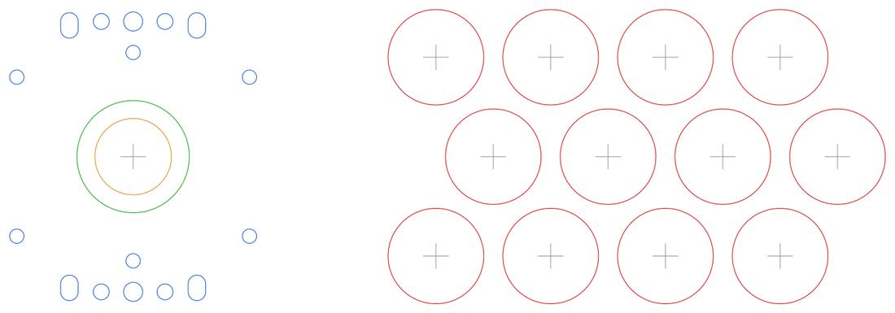 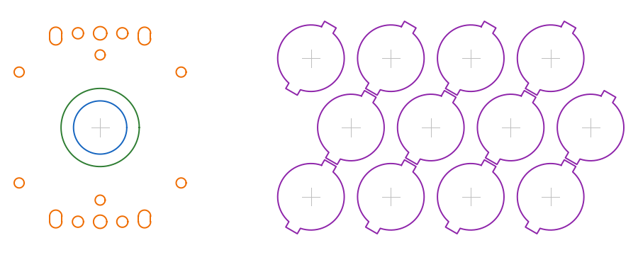

*Left: standard. Right: inner support, with the hole and its Sanwa OBSF ear relief merged into one profile.*

> Zigzag template from which various layouts can be made.
>
> *Slagcoin*

Alternating high and low on a tight horizontal step. The widest template of the three, and the most useful for exploring staggered or wave shaped arrangements.

**12 buttons**  |  stock lever at **95 mm**  |  closest button pitch 36.0 mm at 30 mm, 28.8 mm at 24 mm  |  cut envelope 275 x 92 mm

More previews: [24 mm buttons](preview/zigzag36_s_24mm_buttons.png) &middot; [24 mm inner support](preview/inner_support_zigzag36_s_24mm_buttons.png)

| Version | 30 mm buttons | 24 mm buttons |
|---|---|---|
| Stock | [dxf](dxf/zigzag36_s.dxf) &middot; [svg](svg/zigzag36_s.svg) | [dxf](dxf/zigzag36_s_24mm_buttons.dxf) &middot; [svg](svg/zigzag36_s_24mm_buttons.svg) |
| Stock, inner support | [dxf](dxf/inner_support_zigzag36_s.dxf) &middot; [svg](svg/inner_support_zigzag36_s.svg) | [dxf](dxf/inner_support_zigzag36_s_24mm_buttons.dxf) &middot; [svg](svg/inner_support_zigzag36_s_24mm_buttons.svg) |
| 82 mm | [dxf](dxf/zigzag36_s_82mm_spacing.dxf) &middot; [svg](svg/zigzag36_s_82mm_spacing.svg) | [dxf](dxf/zigzag36_s_82mm_spacing_24mm_buttons.dxf) &middot; [svg](svg/zigzag36_s_82mm_spacing_24mm_buttons.svg) |
| 82 mm, inner support | [dxf](dxf/inner_support_zigzag36_s_82mm_spacing.dxf) &middot; [svg](svg/inner_support_zigzag36_s_82mm_spacing.svg) | [dxf](dxf/inner_support_zigzag36_s_82mm_spacing_24mm_buttons.dxf) &middot; [svg](svg/inner_support_zigzag36_s_82mm_spacing_24mm_buttons.svg) |
| 95 mm | [dxf](dxf/zigzag36_s_95mm_spacing.dxf) &middot; [svg](svg/zigzag36_s_95mm_spacing.svg) | [dxf](dxf/zigzag36_s_95mm_spacing_24mm_buttons.dxf) &middot; [svg](svg/zigzag36_s_95mm_spacing_24mm_buttons.svg) |
| 95 mm, inner support | [dxf](dxf/inner_support_zigzag36_s_95mm_spacing.dxf) &middot; [svg](svg/inner_support_zigzag36_s_95mm_spacing.svg) | [dxf](dxf/inner_support_zigzag36_s_95mm_spacing_24mm_buttons.dxf) &middot; [svg](svg/inner_support_zigzag36_s_95mm_spacing_24mm_buttons.svg) |


---

## Full index

Cut envelope is the outermost cut geometry with the lever mounting holes included. Add your own margin on top of that for palm rest. Slagcoin is emphatic that you want plenty of panel in front of and beside the devices.


| Layout | What it is | Buttons | Stock lever | Cut envelope |
|---|---|---:|---:|---|
| [`sega1_s`](#sega-astro-city--blast-city-p1) | Sega Astro City / Blast City P1 | 8 | 59 mm | 222 x 99 mm |
| [`sega2_s`](#sega-p2-non-slanted) | Sega P2, non slanted | 8 | 63 mm | 219 x 100 mm |
| [`vewlix_s`](#vewlix-7-button-as-drawn) | Vewlix, 7 button as drawn | 7 | 59 mm | 225 x 91 mm |
| [`vewlix_s_8button`](#vewlix-44-8-button) | Vewlix 4+4, 8 button | 8 | 59 mm | 225 x 91 mm |
| [`shift36_s`](#generic-shift) | Generic shift | 8 | 95 mm | 261 x 99 mm |
| [`hori36_s`](#hori-transitioning-1) | Hori transitioning | 8 | 63.75 mm | 220 x 96 mm |
| [`horis36_s`](#hori-transitioning-spaced-rows) | Hori transitioning, spaced rows | 8 | 63.75 mm | 220 x 100 mm |
| [`cluster36_s`](#clustered-arcade-1) | Clustered arcade | 8 | 95 mm | 251 x 96 mm |
| [`clusters36_s`](#clustered-arcade-spaced-rows) | Clustered arcade, spaced rows | 8 | 95 mm | 251 x 100 mm |
| [`slant36_s`](#direct-slant-1) | Direct slant | 8 | 95 mm | 250 x 96 mm |
| [`slants36_s`](#direct-slant-spaced-rows) | Direct slant, spaced rows | 8 | 95 mm | 250 x 100 mm |
| [`hybrid36_s`](#moderate--hybrid) | Moderate / hybrid | 8 | 95 mm | 253 x 96 mm |
| [`hybrids36_s`](#moderate--hybrid-spaced-rows) | Moderate / hybrid, spaced rows | 8 | 95 mm | 253 x 100 mm |
| [`incline36_s`](#straight-incline-1) | Straight incline | 8 | 95 mm | 251 x 96 mm |
| [`inclines36_s`](#straight-incline-spaced-rows) | Straight incline, spaced rows | 8 | 95 mm | 251 x 100 mm |
| [`matrix36_s`](#square-grid) | Square grid | 8 | 95 mm | 257 x 91 mm |
| [`matrixs36_s`](#square-grid-spaced-rows) | Square grid, spaced rows | 8 | 95 mm | 257 x 91 mm |
| [`american_s`](#capcom-usa-street-fighter) | Capcom USA Street Fighter | 6 | 95 mm | 225 x 91 mm |
| [`mesh36_s`](#mesh-template) | Mesh template | 13 | 95 mm | 274 x 102 mm |
| [`rhombus36_s`](#rhombus-template) | Rhombus template | 9 | 95 mm | 276 x 91 mm |
| [`zigzag36_s`](#zigzag-template) | Zigzag template | 12 | 95 mm | 275 x 92 mm |


Every layout above also exists as `_82mm_spacing` and `_95mm_spacing`, in both DXF and SVG.

---

## All button layouts

Leverless panels. No joystick, so no lever spacing and no joystick bores. These are drawn as designed, with their native mix of 24 mm and 30 mm holes, and they ship as a single file each rather than in spacing and button size variants.

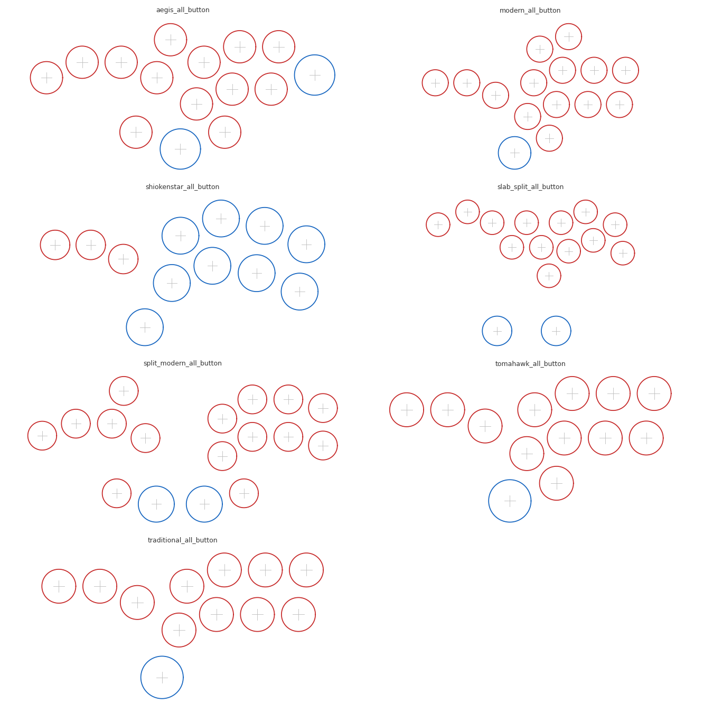

> **Who made these.** The all button layouts were created by [JasensCustoms.com](https://www.jasenscustoms.com) and members of the Panzer user community. They may draw inspiration from other all button layouts out in the world, but they are not exact replicas of any of them.

Two things differ from the joystick layouts:

- **Layers.** Holes are split across `BUTTONS_24` and `BUTTONS_30` rather than a single `BUTTONS` layer, because these layouts mix the two sizes and you will likely want a different tool for each. There are no joystick or plate layers.
- **Origin.** (0,0) is the centre of the button cluster bounding box, since there is no joystick to reference.

Panel outlines, mounting screw holes, USB and cable cutouts from the source drawings were deliberately left out. What you get is the button pattern, to drop onto whatever panel you are building.

Hole diameters are normalised to exactly 24.00 mm and 30.00 mm. The source drawings carry between 0.00 and 0.21 mm of clearance depending on which file they came from, which is a cutting decision better made at CAM time for your own machine and material. Button positions are preserved exactly as drawn.

### Traditional

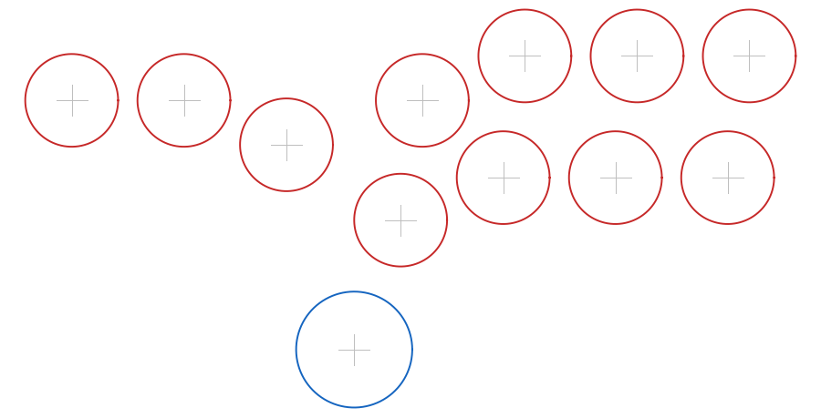 

*Left: standard. Right: inner support, with the hole and its Sanwa OBSF ear relief merged into one profile.*

The baseline all button layout. A four button directional cluster on the left, eight action buttons in two staggered rows on the right, and a single 30 mm thumb button below. If someone is building their first leverless and does not know what they want, this is the one to print and feel first.

**12 buttons**  |  11 x 24 mm and 1 x 30 mm  |  closest pitch 28.7 mm  |  cut envelope 199 x 103 mm

| Version | Files |
|---|---|
| Standard | [dxf](dxf/traditional_all_button.dxf) &middot; [svg](svg/traditional_all_button.svg) |
| Inner support | [dxf](dxf/inner_support_traditional_all_button.dxf) &middot; [svg](svg/inner_support_traditional_all_button.svg) |

### Modern

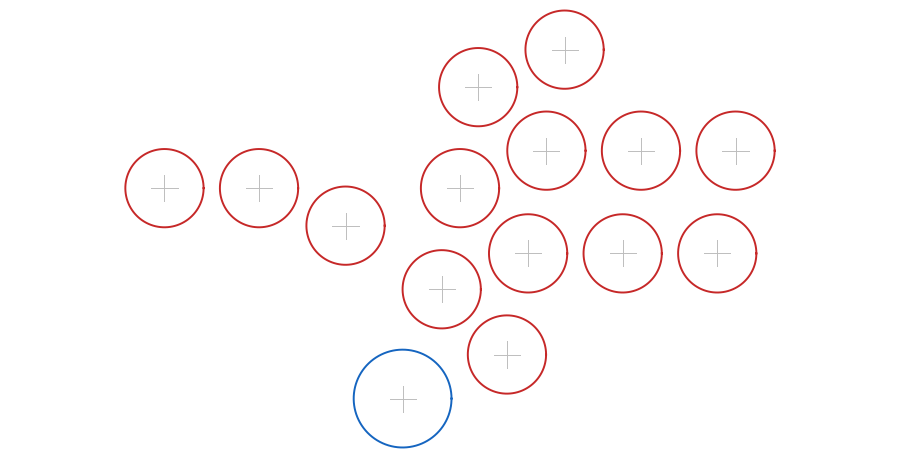 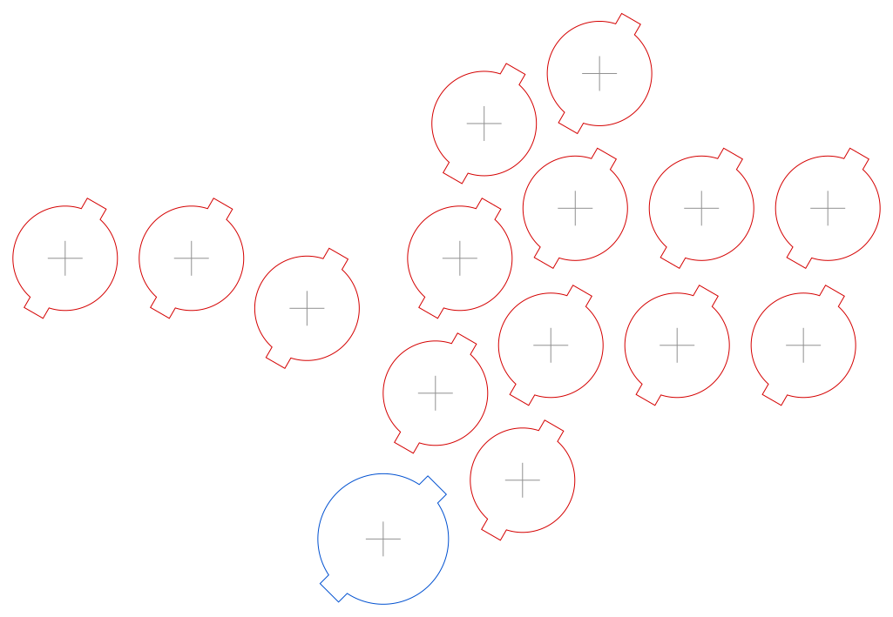

*Left: standard. Right: inner support, with the hole and its Sanwa OBSF ear relief merged into one profile.*

The Traditional shape opened out, with an extra pair of buttons on the right hand cluster and a taller stagger between the rows. More reach for the ring and pinky, and more room to sit your hand deeper into the panel.

**15 buttons**  |  14 x 24 mm and 1 x 30 mm  |  closest pitch 28.3 mm  |  cut envelope 199 x 134 mm

| Version | Files |
|---|---|
| Standard | [dxf](dxf/modern_all_button.dxf) &middot; [svg](svg/modern_all_button.svg) |
| Inner support | [dxf](dxf/inner_support_modern_all_button.dxf) &middot; [svg](svg/inner_support_modern_all_button.svg) |

### Tomahawk

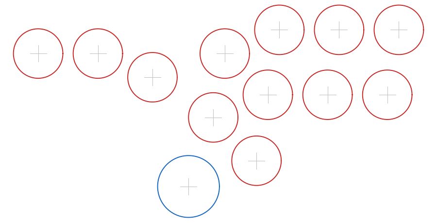 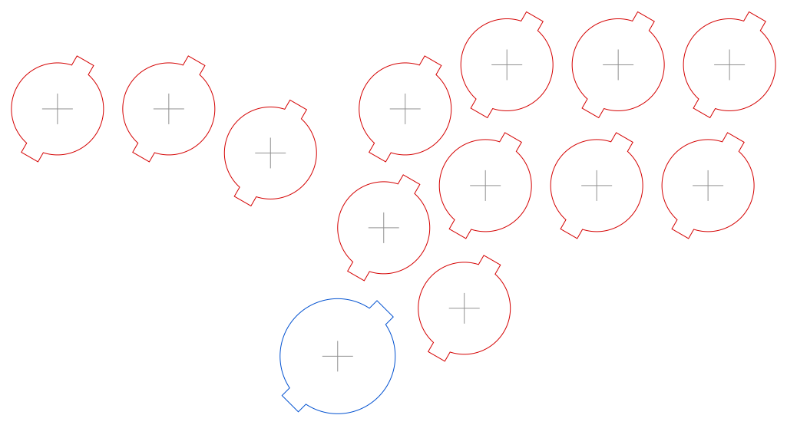

*Left: standard. Right: inner support, with the hole and its Sanwa OBSF ear relief merged into one profile.*

A compact take on the Traditional idea. Same footprint width, one fewer button, and the right hand cluster pulled in slightly so the whole thing sits comfortably on a smaller panel.

**13 buttons**  |  12 x 24 mm and 1 x 30 mm  |  closest pitch 28.7 mm  |  cut envelope 199 x 103 mm

| Version | Files |
|---|---|
| Standard | [dxf](dxf/tomahawk_all_button.dxf) &middot; [svg](svg/tomahawk_all_button.svg) |
| Inner support | [dxf](dxf/inner_support_tomahawk_all_button.dxf) &middot; [svg](svg/inner_support_tomahawk_all_button.svg) |

### Aegis

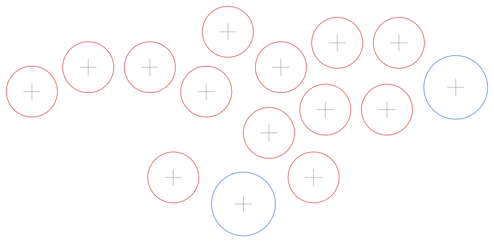 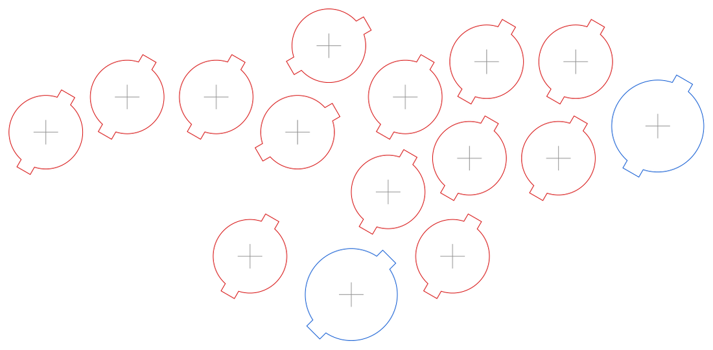

*Left: standard. Right: inner support, with the hole and its Sanwa OBSF ear relief merged into one profile.*

A wide, shallow arc. The buttons spread further across the panel and the arc through the action cluster is flatter than the Traditional, which suits players who keep their hand low and flat rather than curled.

**15 buttons**  |  13 x 24 mm and 2 x 30 mm  |  closest pitch 28.7 mm  |  cut envelope 226 x 108 mm

| Version | Files |
|---|---|
| Standard | [dxf](dxf/aegis_all_button.dxf) &middot; [svg](svg/aegis_all_button.svg) |
| Inner support | [dxf](dxf/inner_support_aegis_all_button.dxf) &middot; [svg](svg/inner_support_aegis_all_button.svg) |

### Shiokenstar

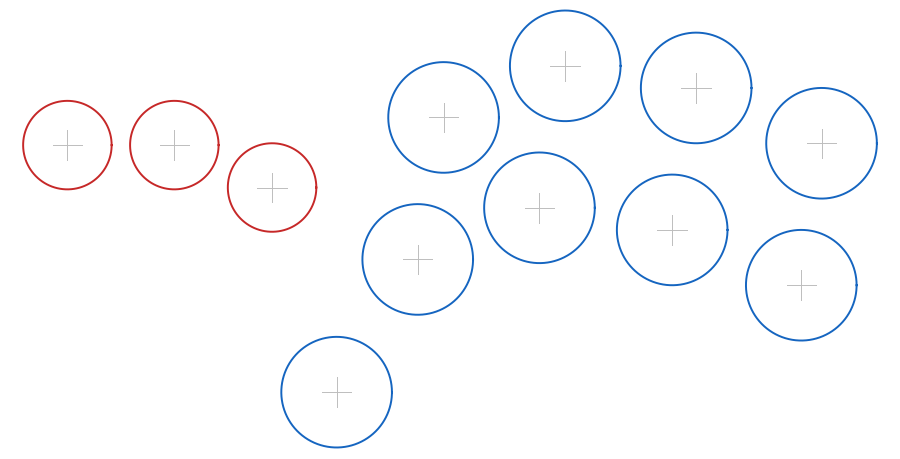 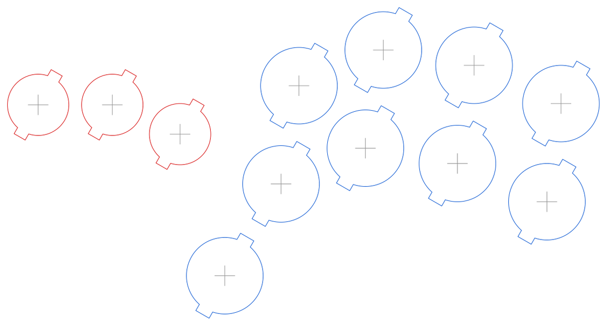

*Left: standard. Right: inner support, with the hole and its Sanwa OBSF ear relief merged into one profile.*

The 30 mm layout of the set. Nine of the twelve holes are 30 mm rather than 24 mm, with only the directional cluster left at 24 mm. If you want the feel of full size buttons on a leverless panel, this is the one built for it.

**12 buttons**  |  3 x 24 mm and 9 x 30 mm  |  closest pitch 28.9 mm  |  cut envelope 231 x 118 mm

| Version | Files |
|---|---|
| Standard | [dxf](dxf/shiokenstar_all_button.dxf) &middot; [svg](svg/shiokenstar_all_button.svg) |
| Inner support | [dxf](dxf/inner_support_shiokenstar_all_button.dxf) &middot; [svg](svg/inner_support_shiokenstar_all_button.svg) |

### Slab Split

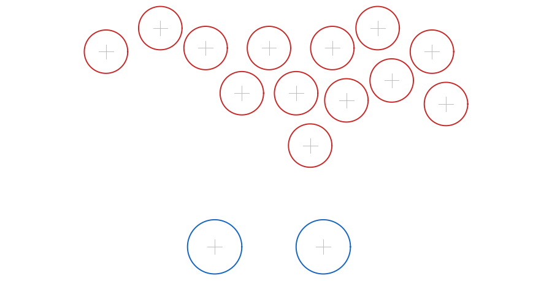 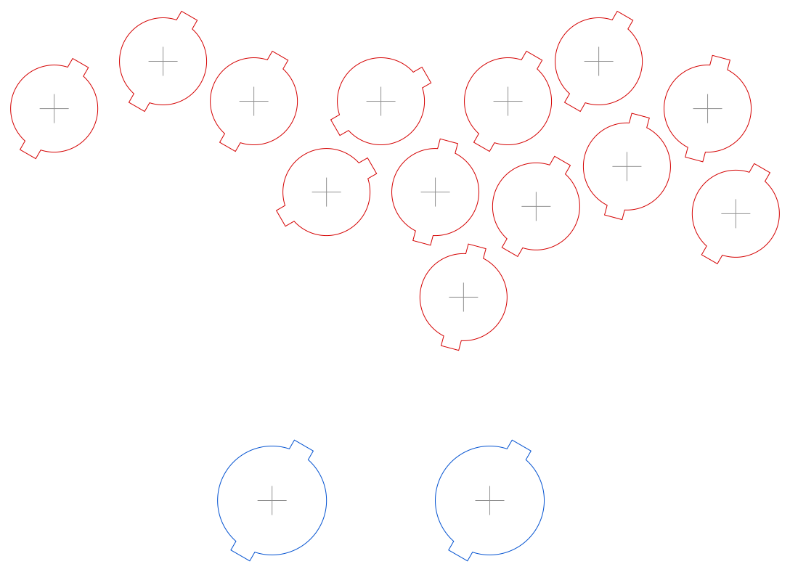

*Left: standard. Right: inner support, with the hole and its Sanwa OBSF ear relief merged into one profile.*

A split layout. The directional and action clusters sit close together up top while the two 30 mm thumb buttons drop well below the main cluster, giving the thumbs their own dedicated space instead of tucking them under the hand.

**15 buttons**  |  13 x 24 mm and 2 x 30 mm  |  closest pitch 27.3 mm  |  cut envelope 212 x 148 mm

| Version | Files |
|---|---|
| Standard | [dxf](dxf/slab_split_all_button.dxf) &middot; [svg](svg/slab_split_all_button.svg) |
| Inner support | [dxf](dxf/inner_support_slab_split_all_button.dxf) &middot; [svg](svg/inner_support_slab_split_all_button.svg) |

### Split Modern

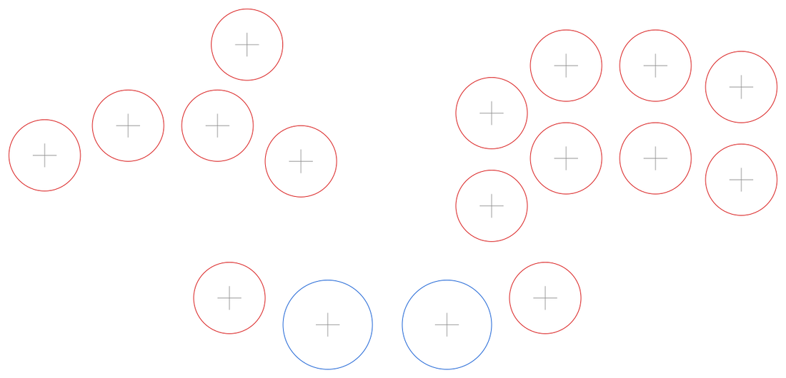 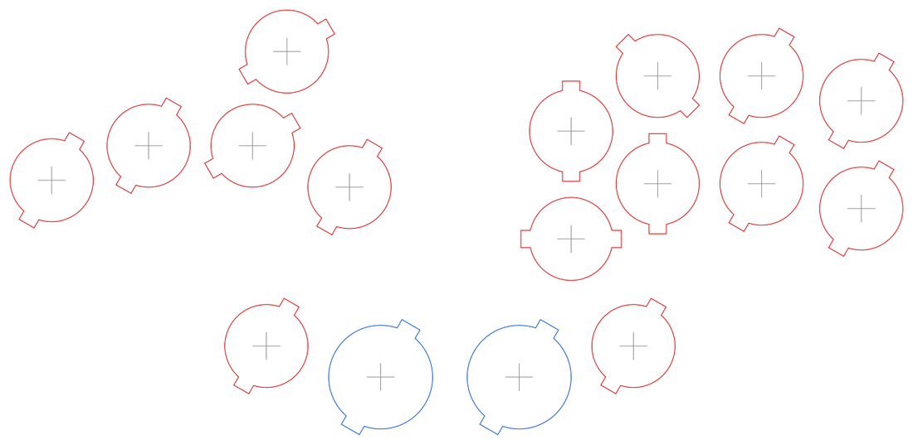

*Left: standard. Right: inner support, with the hole and its Sanwa OBSF ear relief merged into one profile.*

The largest layout here at 17 buttons, and a true split. Left and right clusters are separated across the panel with a pair of 30 mm thumb buttons in the middle, so each hand gets its own island. Widest cut envelope of the set.

**17 buttons**  |  15 x 24 mm and 2 x 30 mm  |  closest pitch 29.0 mm  |  cut envelope 258 x 121 mm

| Version | Files |
|---|---|
| Standard | [dxf](dxf/split_modern_all_button.dxf) &middot; [svg](svg/split_modern_all_button.svg) |
| Inner support | [dxf](dxf/inner_support_split_modern_all_button.dxf) &middot; [svg](svg/inner_support_split_modern_all_button.svg) |

---

## All button index

| Layout | Buttons | 24 mm | 30 mm | Cut envelope |
|---|---:|---:|---:|---|
| [`traditional_all_button`](#traditional) | 12 | 11 | 1 | 199 x 103 mm |
| [`modern_all_button`](#modern) | 15 | 14 | 1 | 199 x 134 mm |
| [`tomahawk_all_button`](#tomahawk) | 13 | 12 | 1 | 199 x 103 mm |
| [`aegis_all_button`](#aegis) | 15 | 13 | 2 | 226 x 108 mm |
| [`shiokenstar_all_button`](#shiokenstar) | 12 | 3 | 9 | 231 x 118 mm |
| [`slab_split_all_button`](#slab-split) | 15 | 13 | 2 | 212 x 148 mm |
| [`split_modern_all_button`](#split-modern) | 17 | 15 | 2 | 258 x 121 mm |


---

## Manufacturer layouts

Layouts taken from commercial arcade sticks. Each one names its maker and says how it was obtained.

### ASI S24

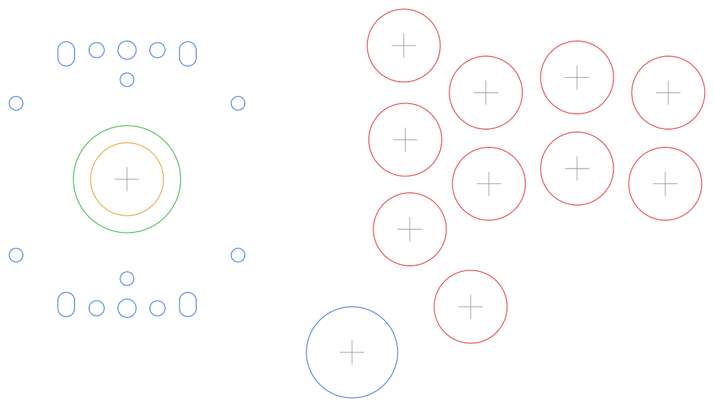 

*Left: standard. Right: inner support.*

The S24 layout from **ASI**. A lever on the left, ten 24 mm buttons in two arcs of four with a pair dropping down to the left, and a single 30 mm button below the cluster.

**11 buttons**  |  10 x 24 mm and 1 x 30 mm  |  closest pitch 29.4 mm  |  lever to nearest button 74 mm  |  cut envelope 229 x 128 mm

> **This one was measured from a render, not supplied as a file.** Everything else in this repository comes from a dimensioned drawing or a vector source. This layout was recovered by circle fitting ASI's published product render, so treat it as accurate to roughly a third of a millimetre rather than exact. Print it and check it against a real S24 before cutting anything expensive.

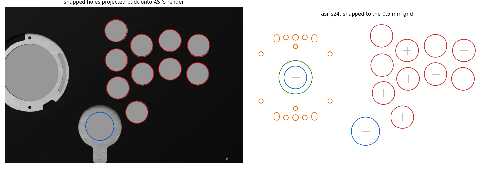

**Positions are snapped to a 0.5 mm grid.** Real panel layouts are laid out on whole or half millimetre spacings, so the raw measured decimals are measurement noise rather than design intent. Every hole was moved to the nearest 0.5 mm node, which shifted each one by at most 0.22 mm. All horizontal and vertical spacings between holes are now exact multiples of 0.5 mm.

Worth being straight about what that does and does not buy. My measurement scatter is around 0.12 mm per coordinate, which is not fine enough to *detect* a 0.5 mm grid on its own: the residuals before snapping sit at 0.122 mm against the 0.144 mm you would expect from no grid at all. So the snap rests on how these panels are actually designed, not on the render proving it. If the grid holds, most coordinates are now exactly right instead of slightly off. A small number sitting near a midpoint could have landed one 0.5 mm step away, and the render cannot tell me which. The scale itself was **not** adjusted to fit the grid, since doing so pushed the measured hole diameters away from nominal.

How it was measured. The ten 24 mm holes came out 101.30 px across with a standard deviation of 0.17 px, which says the render is effectively orthographic and gives the scale at 4.221 px per mm. That scale is corroborated independently by the lever plate bore, which then measures 60.13 mm and is almost certainly a true 60 mm. Every generated hole was projected back onto the render and checked against the drawn edge.

**Lever treatment.** The render shows ASI's own mounting plate with roughly a 60 mm bore. These files instead carry the repository's standard treatment: concentric 24 mm and 35.25 mm bores plus the universal plate pattern. If you are fitting ASI's actual plate you will want their bore, not either of these.

The 30 mm button sits on its own sub plate in the render, a 46 mm disc with a tab below it. That sub plate and its screw are not included, in keeping with how every other layout here drops panel outlines and mounting hardware.

| Version | DXF | SVG |
|---|---|---|
| Standard | [`asi_s24.dxf`](dxf/asi_s24.dxf) | [`asi_s24.svg`](svg/asi_s24.svg) |
| Inner support | [`inner_support_asi_s24.dxf`](dxf/inner_support_asi_s24.dxf) | [`inner_support_asi_s24.svg`](svg/inner_support_asi_s24.svg) |

### ASI S30

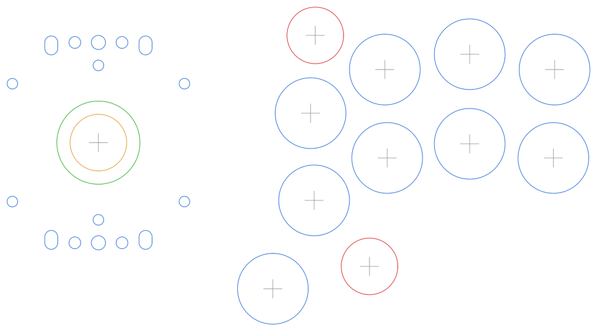 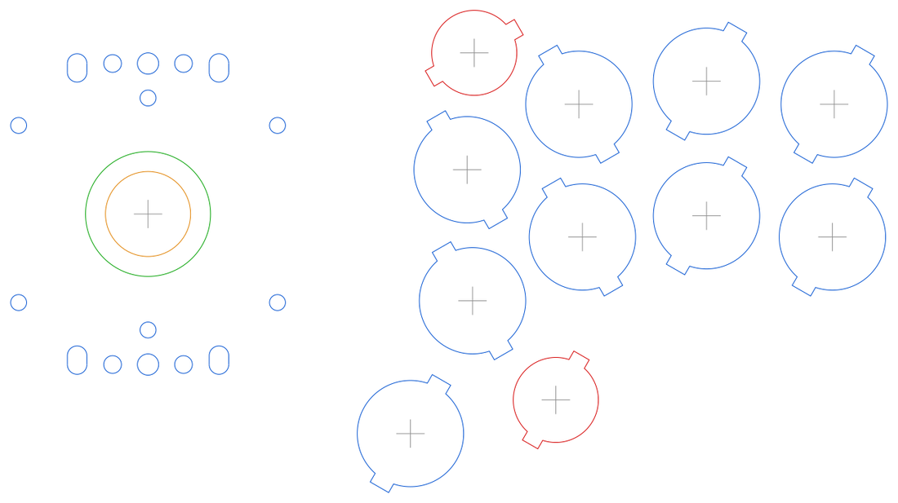

*Left: standard. Right: inner support.*

The S30 from **ASI**, the 30 mm sibling of the S24. Same overall shape, scaled up for full size buttons: eight 30 mm in two arcs of four, a 24 mm at the top of the cluster and another below it, and a 30 mm on its own sub plate at the bottom left.

**11 buttons**  |  9 x 30 mm and 2 x 24 mm  |  closest pitch 32.9 mm  |  lever to nearest button 74 mm  |  cut envelope 247 x 134 mm

> **Measured from a render, same as the S24.** Accurate to roughly a third of a millimetre rather than exact. Print it and check it against a real S30 before cutting.

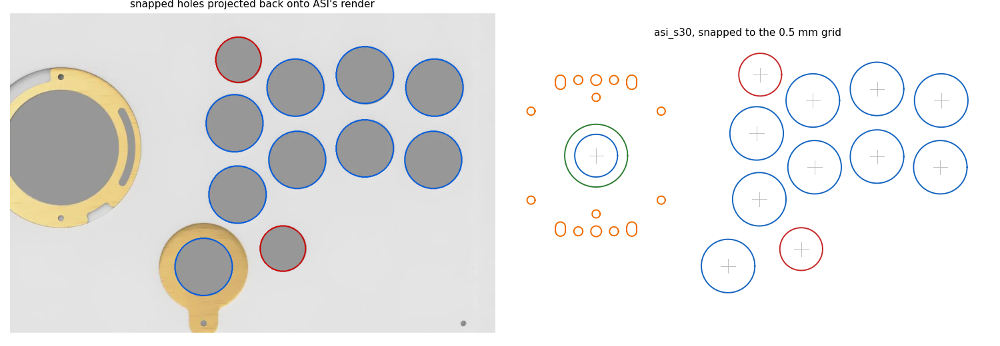

**Positions are snapped to a 0.5 mm grid.** Real panel layouts are laid out on whole or half millimetre spacings, so the raw measured decimals are measurement noise rather than design intent. Every hole was moved to the nearest 0.5 mm node, which shifted each one by at most 0.20 mm. All horizontal and vertical spacings between holes are now exact multiples of 0.5 mm.

Worth being straight about what that does and does not buy. My measurement scatter is around 0.12 mm per coordinate, which is not fine enough to *detect* a 0.5 mm grid on its own: the residuals before snapping sit at 0.124 mm against the 0.144 mm you would expect from no grid at all. So the snap rests on how these panels are actually designed, not on the render proving it. If the grid holds, most coordinates are now exactly right instead of slightly off. A small number sitting near a midpoint could have landed one 0.5 mm step away, and the render cannot tell me which. The scale itself was **not** adjusted to fit the grid, since doing so pushed the measured hole diameters away from nominal.

This one carries an unusually strong internal check. Calibrating the scale on the eight 30 mm holes alone makes two other features fall out correctly without being fitted to: the pair of small buttons measure **23.98 mm** and the lever bore measures **60.09 mm**. Three independent features agreeing at that level means the render is orthographic and the scale is right. Every hole then measured within 0.1 mm of its nominal size before being normalised.

Same lever treatment and the same dropped sub plate as the S24 above.

| Version | DXF | SVG |
|---|---|---|
| Standard | [`asi_s30.dxf`](dxf/asi_s30.dxf) | [`asi_s30.svg`](svg/asi_s30.svg) |
| Inner support | [`inner_support_asi_s30.dxf`](dxf/inner_support_asi_s30.dxf) | [`inner_support_asi_s30.svg`](svg/inner_support_asi_s30.svg) |

### ASI B30

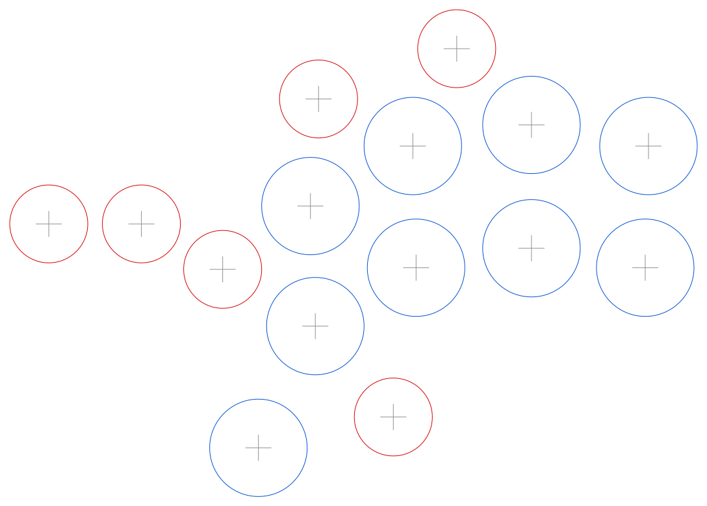 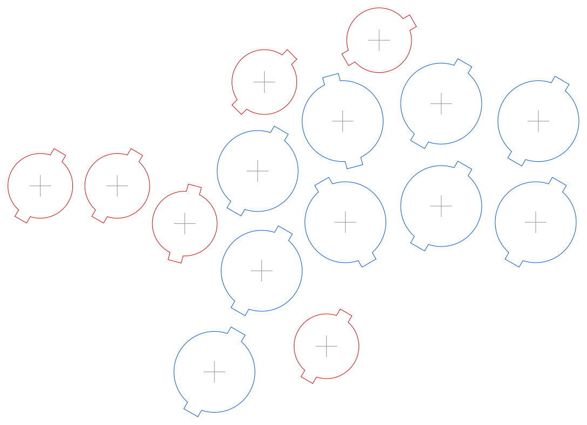

*Left: standard. Right: inner support.*

The B30 from **ASI**. The B is for buttons: this one is leverless, so it follows the all button conventions rather than the S24 and S30 above. No lever, no joystick bores, no plate pattern, and the origin is the centre of the button cluster rather than a lever centre.

Fifteen holes in a wide sweeping arc: nine at 30 mm including the one on the gold sub plate, and six at 24 mm running out to the left and marking the ends of the cluster.

**15 buttons**  |  9 x 30 mm and 6 x 24 mm  |  closest pitch 28.5 mm  |  cut envelope 212 x 150 mm

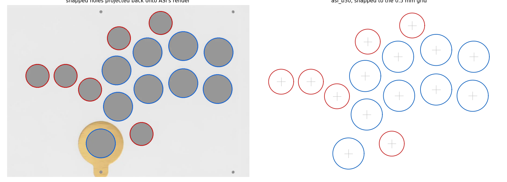

Measured from ASI's published render the same way as the other two, with the same three way agreement: calibrating the scale on the eight 30 mm cluster holes makes the six 24 mm holes read **23.99 mm** and the sub plate button read **30.08 mm**, neither of which was fitted to. Positions are snapped to the 0.5 mm grid, moving each hole by at most 0.23 mm. The gold sub plate and its screw are dropped, keeping only the button inside it. Accurate to roughly a third of a millimetre; check it against a real B30 before cutting.

| Version | DXF | SVG |
|---|---|---|
| Standard | [`asi_b30.dxf`](dxf/asi_b30.dxf) | [`asi_b30.svg`](svg/asi_b30.svg) |
| Inner support | [`inner_support_asi_b30.dxf`](dxf/inner_support_asi_b30.dxf) | [`inner_support_asi_b30.svg`](svg/inner_support_asi_b30.svg) |

---

## Before you cut

- **Test print first.** Print the SVG at 100 percent scale and rest your hand on it. Slagcoin's advice, *"Feeling these can give you an idea of what layout will likely suit you"*, is the single most valuable line on the whole site. A sheet of paper costs nothing. A mis-drilled panel costs a weekend.
- **Pick one joystick bore**, 24 mm or 35.25 mm, and delete the other layer.
- **Delete the `REFERENCE` layer** before sending anything to CAM. Those crosshairs are alignment aids, not cuts.
- **Check your nuts.** On the 30 mm files, `vewlix_s`, `vewlix_s_8button`, `shift36_s` and `sega1_s` have closest button pairs just under 36 mm, and standard Sanwa screw in nuts are about that wide. On the 24 mm files the equivalent pairs land around 28.4 to 28.8 mm, which suits snap ins better than screw ins.
- **On inner support files**, each button is already a single closed profile. Cut it as one contour, inside offset, same as any other hole. Slot direction varies across a panel by design; see [Inner support versions](#inner-support-versions).
- **Cut a test piece in scrap** before you commit to your real panel material.
- **Check the file yourself.** These were traced carefully and verified against the originals, but it is far better to find a problem in CAD than in aluminium.

---

## How these were made

For the Slagcoin derived layouts, the source images are his own to scale diagrams. Each one was traced by locating every drawn circle to sub pixel accuracy, converting to millimetres, and snapping the result to the same quarter millimetre grid that his printed dimension callouts use. Every generated hole was then projected back onto the original diagram and checked against the drawn ink, and the button counts were re verified independently.

Layouts added later may come from a different source, a manufacturer drawing, a measured panel or an original design. Whatever the source, the same output conventions apply: millimetres, joystick at the origin, the same five layers, and the same set of spacing and button size variants.

<details>
<summary>Technical detail, for the curious</summary>

<br>

**Tracing.** Device circles were located by an iterated least squares circle fit. For each of 1440 angles around a candidate centre, the darkness weighted radial centroid of the drawn stroke was taken as an edge sample, then a Kasa algebraic fit was run over those samples with outlier rejection. This resolves the drawn circle path rather than the stroke edge, so the diameters come out unbiased.

**Scale.** The images are labelled 72 PPI. Solving a single global scale across all 20 source diagrams gives an effective 71.871 PPI, or 0.353409 mm per pixel. That value is confirmed independently by the button holes landing on exactly 30.00 mm and by every column pitch landing on its printed callout.

**Snapping.** All of Slagcoin's printed dimensions are multiples of 0.25 mm, so measured centres were fitted to that grid. Worst deviation across the whole set after snapping is under 0.11 mm, with an RMS of roughly 0.04 mm. A handful of single grid step slips were resolved by hand against the printed overall width totals, which the source diagrams conveniently include.

**Imperial exception.** `american_s` is dimensioned in inches on the original (11/16, 1-3/8 and 1-1/2 inch), so it was rebuilt on exact imperial values rather than forced onto the metric grid.

**Verification.** Each generated circle was re projected onto its source PNG and scored on the fraction of its circumference that falls on drawn ink. The minimum score across all 214 holes was 0.986 and the mean was 1.000. Button counts were then re checked with an independent ring matched filter, which agreed on all 20 diagrams. Every spacing variant was re read from disk and checked for exact first column distance, unchanged Y coordinates and unchanged cluster shape.

**24 mm versions.** Generated by reading the shipped 30 mm DXF back off disk, scaling the button cluster by 0.8 about the first button column horizontally and the joystick centreline vertically, and setting the hole diameter to 24.00 mm. All 63 were then re read and checked: every hole exactly 24.00 mm, every pairwise button distance exactly 0.8 times the original, and the bores, plate holes and lever spacing identical to their 30 mm parent.

**Lever mounting holes.** Taken from the GL lever mounting plate DXF by [ASI](https://asindo.pro/), symmetrised about the joystick centre. The plate outline and the four holes on the 45 mm cross immediately flanking the bore were deliberately left out.

</details>

---

## Licence and attribution

Layouts in this repository come from more than one place, so credit is tracked per layout rather than claimed in bulk. [NOTICE.md](NOTICE.md) lists every source. The catalogue entry for each layout names its origin.

**The 21 joystick layouts come from [slagcoin.com](https://www.slagcoin.com/joystick/layout.html).** Those layouts are his design work, published free as a resource for people building arcade controllers. What is added here is the conversion into true scale vector geometry, the lever mounting hardware, and the spacing and button size variants. Credit for the underlying layouts belongs to Slagcoin.

**The 7 all button layouts come from [JasensCustoms.com](https://www.jasenscustoms.com) and members of the Panzer user community.** They may draw inspiration from other all button layouts, but they are not exact replicas of any of them.

**The S24, S30 and B30 layouts are ASI's.** They were measured from their published product renders rather than supplied as files, and these are not official ASI files. Credit for the layouts belongs to ASI.

**Thank you to [ASI](https://asindo.pro/)** for the GL lever layout used for the joystick mounting holes. The `GL_PLATE_HOLES` pattern in every joystick layout is based on their GL lever mounting plate.

If the live site is unreachable, the original pages are preserved on the [Wayback Machine](https://web.archive.org/web/*/slagcoin.com/joystick/layout.html).

The conversion work, the mounting hardware geometry and the variant generation are shared freely. Use them, remix them, build things with them, sell the panels you cut from them. When you publish something derived from a layout in here, credit whoever that layout came from.

Everything this repository adds is licensed under [Creative Commons Attribution-ShareAlike 4.0 International](LICENSE) (CC BY-SA 4.0). In short: use, share, adapt and sell the files for any purpose, provided you give credit as described above and in [NOTICE.md](NOTICE.md), and release any modified versions of the files under the same licence. Physical panels cut from the files carry no licence obligations beyond the credit.

---

## Contributing

**Corrections.** Found a hole in the wrong place, or a layout that does not match its source diagram? Open an issue with the file name and what you measured.

**New layouts are welcome.** Manufacturer layouts, cabinet layouts, community favourites and original designs all belong here. To add one, please include:

- where the layout came from, and who should be credited for it
- dimensions or a to scale drawing good enough to work from
- confirmation that the source is yours to share, or is published freely

Anything added gets the same treatment as the existing set: millimetres, joystick at the origin, the standard five layers, 3 joystick positions, 30 mm and 24 mm button sizes, a catalogue entry naming its source, and a line in [NOTICE.md](NOTICE.md).

**Photos.** If you build a panel from one of these, post it in the issues. It is genuinely nice to see them get used.
