# Plexi and 3D printed case

> ## Not yet validated
>
> **As of August 22, 2026, none of these files has been cut, printed or test
> assembled.** The geometry is published as designed, and the numbers in this
> document are measured from the files themselves, but no physical build has
> confirmed that the parts fit together.
>
> Treat everything here as a first release. Cut one of anything before you cut
> six, and expect the tolerances to be the first thing that needs adjusting.
>
> Once a build has been completed this page will be updated to say so, with
> photographs of the assembled case and a list of recommended vendors for the raw
> plexi.

A laser cut acrylic case with 3D printed corner and center supports, sized to take
any of the control panel layouts in the [main repository](../README.md).

Everything here is millimeters. DXF files are the flat cut profiles; STL and STEP
are the printed parts; SLDPRT are the SolidWorks sources.

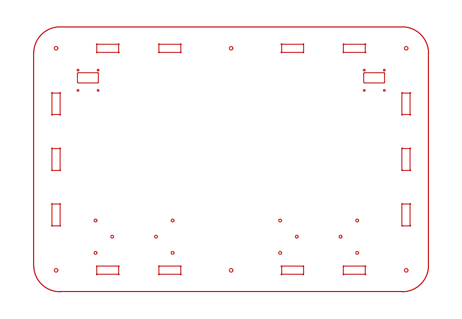 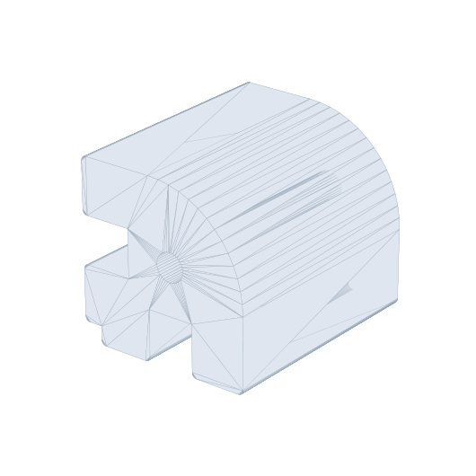

## The case at a glance

| | |
|---|---|
| **Footprint** | **451.0 x 303.0 mm** (17.76 x 11.93 in), 30 mm corner radius |
| **Internal height** | **45.0 mm**, set by the supports and the wall shoulders |
| **Overall height** | **62.2 mm**, being 45 plus an inner and outer layer top and bottom |
| **Inner acrylic** | **5.6 mm** extruded, tolerance +/- 10 to 15 percent (5.2 to 6.0) |
| **Outer acrylic** | **3.0 mm** extruded, tolerance +/- 10 percent (2.7 to 3.30) |
| **Fasteners** | M4, into heat set inserts in the printed supports |

The 451 x 303 mm footprint has room for every layout in this repository several
times over. The largest cut envelope in the library is 278.2 x 151.7 mm.

## Bill of materials

**Acrylic, 16 pieces:**

| Qty | Part | Thickness | File |
|---:|---|---|---|
| 1 | Top, inner layer | 5.6 mm | `Top - Outline N - Inner` |
| 1 | Top, outer layer | 3.0 mm | `Top - Outline N - Outer`, same N |
| 1 | Bottom, inner layer | 5.6 mm | `Bottom - Outline N - Inner` |
| 1 | Bottom, outer layer | 3.0 mm | `Bottom - Outline N - Outer`, same N |
| 4 | Short side, inner | 5.6 mm | `Short Side - JCC`, plain or a button variant |
| 4 | Short side, outer | 3.0 mm | `Short Side - JCC`, plain or a button variant |
| 2 | Long side, inner | 5.6 mm | `Long Side - JCC`, plain or a button variant |
| 2 | Long side, outer | 3.0 mm | `Long Side - JCC`, plain or a button variant |

**Inner and outer are different files for the top and bottom**, and the difference
is the fourteen wall slots. Only the inner layer carries them. See below.

**Printed, 6 pieces:**

| Qty | Part | Files |
|---:|---|---|
| 4 | Corner support | `CornerSupport.STL` / `.STEP` / `.SLDPRT` / `.DXF` |
| 1 | Blank center support | `Blank_CenterSupport.STL` / `.STEP` / `.SLDPRT` / `.DXF` |
| 1 | Neutrik center support | `Neutrik_CenterSupport.STL` / `.STEP` / `.SLDPRT` |
| 0 to 2 | Fight board bracket, optional | `FightBoardBracket.STL` / `.STEP` |

**Each support comes in three fits**, and the file above is the loosest of them.
Measure your acrylic and pick the one that matches before you print; see
[Three fits](#three-fits-because-the-acrylic-has-a-tolerance).

**Hardware:**

| Qty | Item |
|---:|---|
| 12 | M4 brass heat set inserts, [ruthex RX-M4x8.1](https://www.amazon.com/dp/B07YSV66Y5) or equivalent |
| 12 | M4 screws, length to suit your stack |

Per [fight board bracket](#fight-board-bracket), if you print one:

| Qty | Item |
|---:|---|
| 4 | M3 brass heat set inserts, [ruthex RX-M3x5.7](https://www.amazon.com/ruthex-M3-Threaded-Inserts-RX-M3x5-7/dp/B08BCRZZS3) |
| 2 | M3 SHORT brass heat set inserts, [ruthex RX-M3Sx4.0](https://www.amazon.com/ruthex-Threaded-Inserts-Short-RX-M3Sx4-0/dp/B09ZHSGHXD) |
| 2 | M3 flat head screws, **10 mm**, panel down into the bracket base |
| 4 | M3 pan head screws, **8 mm**, board up into the pillars |

Two inserts per support, one in each end of its 5.6 mm through bore, which is why
the panels carry six 4.1 mm clearance holes each: four corners and two centers,
top and bottom.

You will also want flat head screws for whatever you mount to the top inner panel,
a fight board and up to two OLED screens. **Countersink those holes after cutting**
so the heads sit below the surface and the outer layer can lie flat on top.

## Print settings

PETG, **5 wall loops**. The supports carry the whole case and take the insert
heat, so wall count matters more than infill here.

## The parts

### Top and bottom panels

 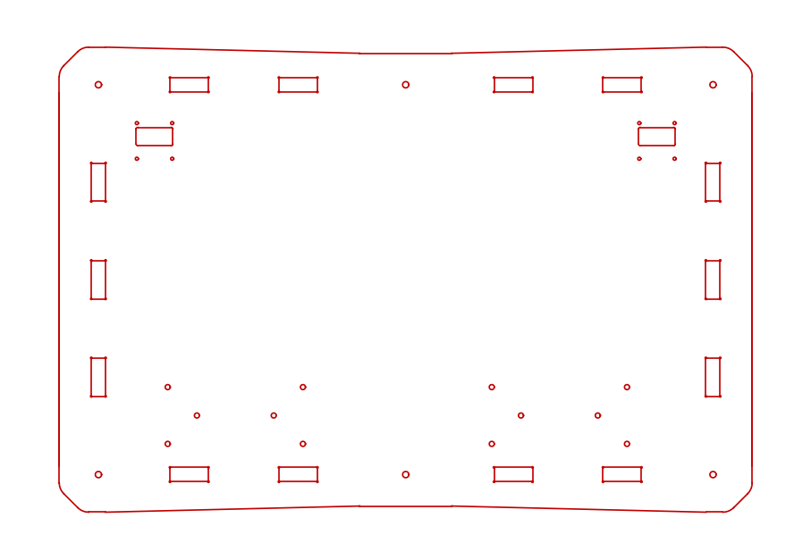

*Left: Outline 1. Right: Outline 2.*

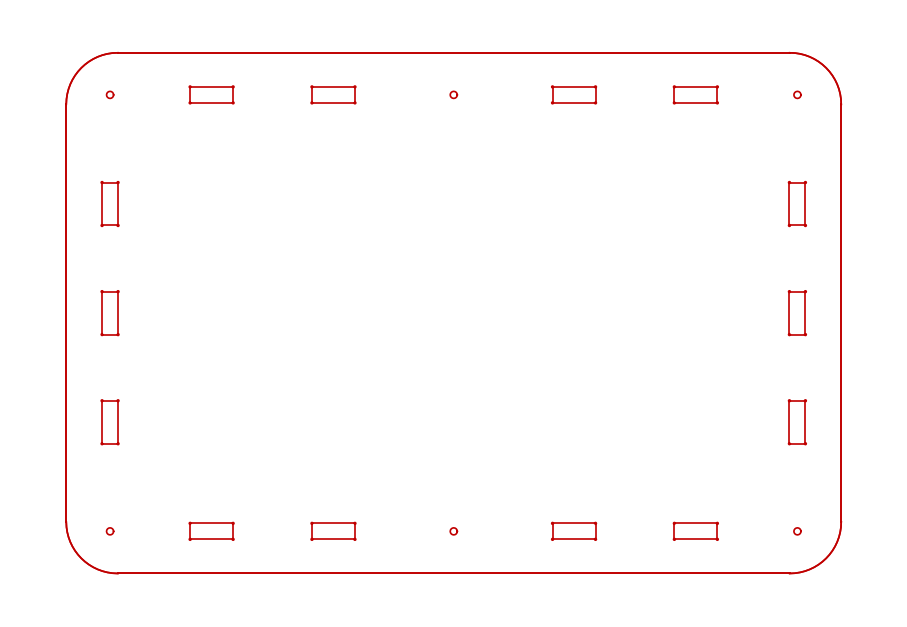 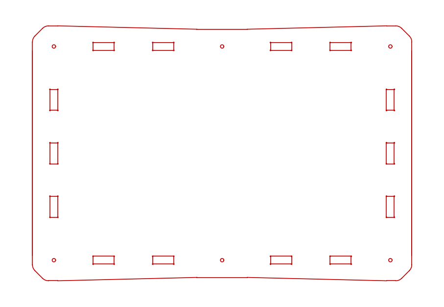

*The matching bottoms. Left: Outline 1. Right: Outline 2.*

**Outline 1 and Outline 2 are the same panel with a different silhouette.** Both
are exactly 451.0 x 303.0 mm with a 30 mm corner radius, and every hole and slot
in them is in the same place to the last decimal. The only difference is the front
and back edge: Outline 1 runs straight across, Outline 2 bows gently outward, so
at 210 mm from center Outline 1 measures 298.285 mm front to back and Outline 2
measures 302.902. Pick the look you want and cut it in both thicknesses.

The bottom inner panel carries the six 4.1 mm mounting holes and the wall slots.
The top inner panel carries those plus:

| Feature | Count | What it is |
|---|---:|---|
| 4.1 mm clearance holes | 6 | the four corner and two center supports |
| 3.3 mm holes | 12 | two fight board mounting clusters of six |
| 2.0 mm holes | 8 | two OLED screen mounts of four |
| 23.9 x 11.9 mm cutouts | 2 | the OLED windows those four fixings surround |

**The cutouts and the 2.0 mm holes take a 0.96 in OLED screen.** There are two
sets, left and right. Cut the side you want and leave the other out, or cut both
if you want a screen at each end.

**The 3.3 mm clusters mount a fight board.** There are two of them for the same
reason: cut both if you like, but only one side is needed. Each cluster is an
**88.0 x 37.0 mm** rectangle of four, with two more **50.0 mm** apart on that
rectangle's centerline, 19.0 mm in from each end. Both clusters are the same
pattern, so anything that fits one fits the other.

The four outer holes are the board's own mounting pattern, for bolting it straight
to the panel on standoffs of your choosing. **The two inner holes are for the
[fight board bracket](#fight-board-bracket) below**, which is the printed
alternative.

All four features are **inner layer only**; see the outer layer note below.

> **Countersink every 2.0 and 3.3 mm hole on the inner panels after cutting**, so
> a flat head screw sits below the surface of the plexi. The outer layer lies
> straight on top of the inner one, and a screw head standing proud will hold the
> two apart.

**Wall slots, and why the outer layer has none.** Three 10.3 x 26 mm slots on each
303 mm edge and four 26 x 10.3 mm slots on each 451 mm edge, fourteen in all. The
10.3 mm width takes the laminated wall, nominally 5.6 plus 3.0 equals 8.6 mm, and
still fits at the worst end of both material tolerances, 6.0 plus 3.3 equals 9.3.

The wall tab is 5.0 mm long and the inner layer is 5.6 mm, so the tab stops 0.6 mm
short of the inner layer's outer face and the outer layer caps it. **The outer
layer therefore must not be cut with those fourteen slots**, which is what the
`- Outer` files are for:

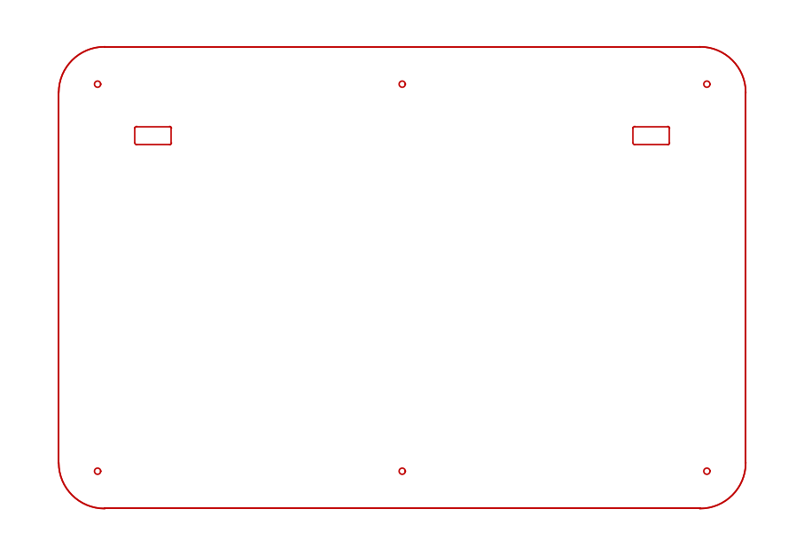 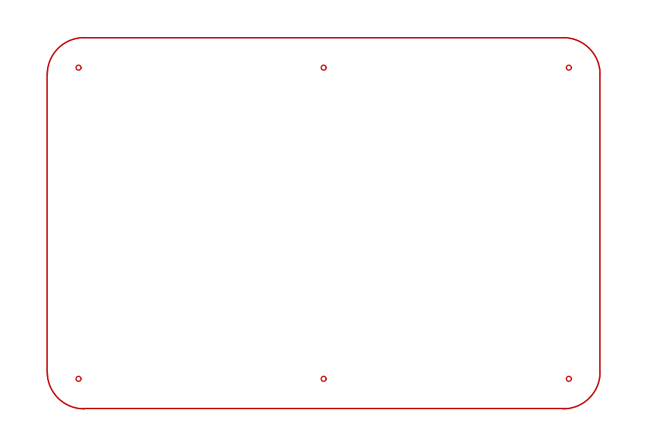

*The outer layers. Left: top. Right: bottom. Same silhouette, the six mounting
holes, and on the top the two connector apertures. Nothing else.*

**The top outer layer also drops the small holes.** The twelve 3.3 mm fight board
mounts and eight 2.0 mm OLED mounts fix hardware to the underside of the top
panel, and their countersunk screw heads sit below the inner layer's surface, so
the 3.0 mm cosmetic layer above them stays solid. Twenty holes plus fourteen slots
come out and the top outer panel goes from 170 entities to 38. The **two
23.9 x 11.9 mm OLED windows stay**, because you have to see the screen.

| Feature | Top inner | Top outer | Bottom inner | Bottom outer |
|---|---:|---:|---:|---:|
| Silhouette | yes | yes | yes | yes |
| Wall slots | 14 | none | 14 | none |
| 4.1 mm mounting holes | 6 | 6 | 6 | 6 |
| 3.3 mm holes | 12 | none | none | none |
| 2.0 mm holes | 8 | none | none | none |
| 23.9 x 11.9 mm OLED windows | 2 | 2 | none | none |

Every outer file is its matching inner with those features deleted and nothing
else touched. Both outlines have an outer version of each panel.

| Layer | Outline 1 | Outline 2 |
|---|---|---|
| Top, inner 5.6 mm | `Top - Outline 1 - Inner - Plexi Case Parts.DXF` | `Top - Outline 2 - Inner - Plexi Case Parts.DXF` |
| Top, outer 3.0 mm | `Top - Outline 1 - Outer - Plexi Case Parts.DXF` | `Top - Outline 2 - Outer - Plexi Case Parts.DXF` |
| Bottom, inner 5.6 mm | `Bottom - Outline 1 - Inner - Plexi Case Parts.DXF` | `Bottom - Outline 2 - Inner - Plexi Case Parts.DXF` |
| Bottom, outer 3.0 mm | `Bottom - Outline 1 - Outer - Plexi Case Parts.DXF` | `Bottom - Outline 2 - Outer - Plexi Case Parts.DXF` |

### Side walls

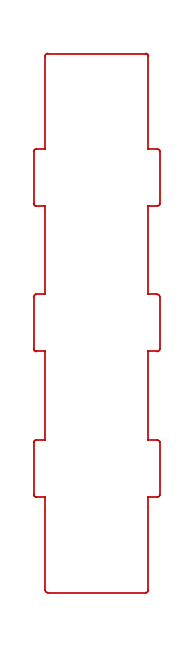 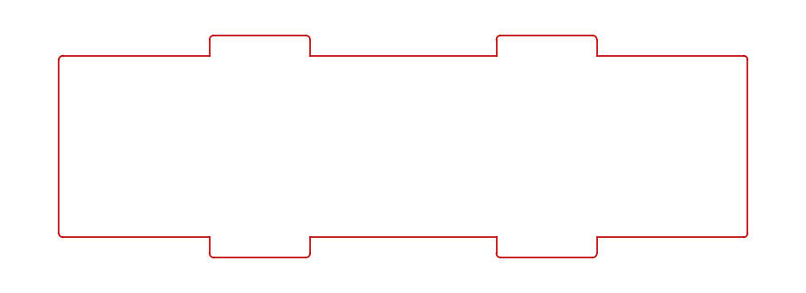

| Part | Size | Tabs |
|---|---|---|
| Long side | 55.0 x 235.402 mm | 3 per edge, into the 303 mm panel edges |
| Short side | 170.5 x 55.0 mm | 2 per edge, two pieces per 451 mm panel edge |

The plain walls are the same file for both layers: they carry no slots, so the
inner and outer cut identically. The **button variants below** are the exception.

Both walls are **55.0 mm** across, made of a **45.0 mm** body between the tab
shoulders and a **5.0 mm** tab at each end. The 45 mm body is what sets the
internal height, and it matches the printed supports exactly. The 5 mm tab enters
the 5.6 mm inner layer and stops 0.6 mm short of its outer face, where the 3.0 mm
outer layer caps it.

### Side walls with buttons

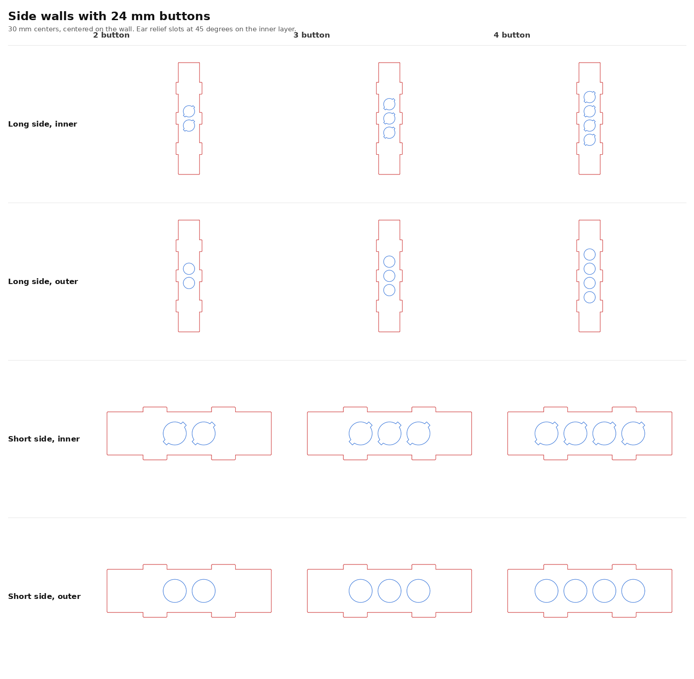

Both walls come in variants carrying **24 mm buttons at 30 mm centers**, in twos,
threes and fours, centered on the wall in both directions. Twelve files in all.

| | 2 button | 3 button | 4 button |
|---|---|---|---|
| **Long side, inner** | [dxf](Long%20Side%20-%20JCC%20-%202%20Button%20Inner%20-%20Plexi%20Case%20Parts.DXF) | [dxf](Long%20Side%20-%20JCC%20-%203%20Button%20Inner%20-%20Plexi%20Case%20Parts.DXF) | [dxf](Long%20Side%20-%20JCC%20-%204%20Button%20Inner%20-%20Plexi%20Case%20Parts.DXF) |
| **Long side, outer** | [dxf](Long%20Side%20-%20JCC%20-%202%20Button%20Outer%20-%20Plexi%20Case%20Parts.DXF) | [dxf](Long%20Side%20-%20JCC%20-%203%20Button%20Outer%20-%20Plexi%20Case%20Parts.DXF) | [dxf](Long%20Side%20-%20JCC%20-%204%20Button%20Outer%20-%20Plexi%20Case%20Parts.DXF) |
| **Short side, inner** | [dxf](Short%20Side%20-%20JCC%20-%202%20Button%20Inner%20-%20Plexi%20Case%20Parts.DXF) | [dxf](Short%20Side%20-%20JCC%20-%203%20Button%20Inner%20-%20Plexi%20Case%20Parts.DXF) | [dxf](Short%20Side%20-%20JCC%20-%204%20Button%20Inner%20-%20Plexi%20Case%20Parts.DXF) |
| **Short side, outer** | [dxf](Short%20Side%20-%20JCC%20-%202%20Button%20Outer%20-%20Plexi%20Case%20Parts.DXF) | [dxf](Short%20Side%20-%20JCC%20-%203%20Button%20Outer%20-%20Plexi%20Case%20Parts.DXF) | [dxf](Short%20Side%20-%20JCC%20-%204%20Button%20Outer%20-%20Plexi%20Case%20Parts.DXF) |

**Inner and outer follow the same rule as the layouts in the main repository.**
The button passes through both sheets, so the outer layer gets a plain 24 mm hole
and the inner layer gets that hole merged with a Sanwa OBSF ear relief slot,
5 x 29 mm, as a single closed profile. Cut it as one contour.

**The ear slots sit at 45 degrees**, not the 60 the rest of the library uses, and
that was solved rather than picked. At 45 the slot corners tuck almost inside the
hole's own bounding box in both axes at once, which makes it the only angle in the
15 degree family that holds the full web between neighbors **and** the most
material to the top and bottom edges of the wall:

| Slot angle | Web between buttons | To the wall edge |
|---|---:|---:|
| 0 or 90 degrees | 1.000 mm | 10.500 mm |
| 60 or 120 degrees | 6.000 mm | 8.693 mm |
| **45 or 135 degrees** | **5.958 mm** | **10.479 mm** |

Every variant measures **5.958 mm** between adjacent profiles and **10.479 mm**
from a profile to the long edges of the wall. End clearance is generous
throughout: the tightest is the four button short side at **28.229 mm** from the
outermost profile to the end of the wall, and each end of a short side is buried
about 4.8 mm inside a support, so there is plenty left over.

> **Check your buttons against the stack.** Inner plus outer is 8.6 mm of acrylic.
> The ear relief lets the retention ears pass through and spring out underneath,
> which is the whole point of it, but 8.6 mm is at the deep end for a snap in.
> Cut one wall in scrap and try a button before committing to four.

### Fight board bracket

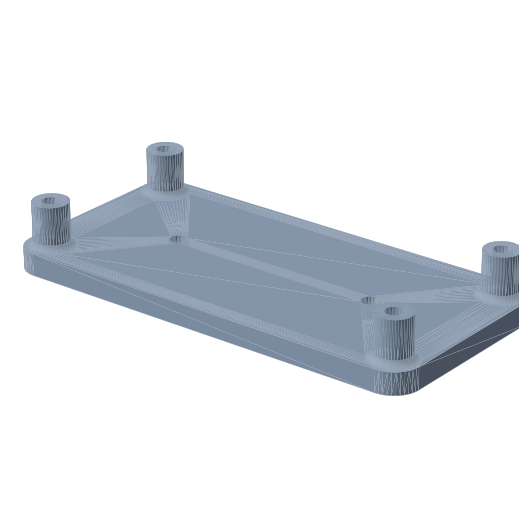

A printed standoff plate that turns one 3.3 mm cluster into a fight board mount.
It bolts to the underside of the top inner panel and holds the board 10 mm clear
of it, so no loose standoffs are needed and nothing shows on the outside of the
case. Optional, and one per board.

| | |
|---|---|
| **Envelope** | 100.0 x 49.0 x 15.0 mm |
| **Base** | 100.0 x 49.0 x 5.0 mm plate, 6 mm corner radius |
| **Pillars** | 4 off, 8.0 mm diameter, 10.0 mm tall, on 88.0 x 37.0 mm centers |
| **Board standoff** | 10.0 mm below the panel |
| **Print** | PETG, 5 wall loops, base down and pillars up, no supports |
| **Files** | `FightBoardBracket.STL`, `FightBoardBracket.STEP` |

**Which panel holes it uses.** The two inner holes of the cluster, the ones
50.0 mm apart. The four outer holes are the alternative, for bolting a board
straight to the panel on standoffs of your own, and they go unused when the
bracket is fitted.

#### Threaded inserts

Both are heat set. The four pillar bores are blind, 7.0 mm deep; the two base
bores go straight through the plate.

| Qty | Insert | Goes in |
|---:|---|---|
| 4 | [ruthex RX-M3x5.7](https://www.amazon.com/ruthex-M3-Threaded-Inserts-RX-M3x5-7/dp/B08BCRZZS3) | the top of each pillar |
| 2 | [ruthex RX-M3Sx4.0 SHORT](https://www.amazon.com/ruthex-Threaded-Inserts-Short-RX-M3Sx4-0/dp/B09ZHSGHXD) | the base, from the face that meets the panel |

Both bores are 4.0 mm. ruthex publishes that figure for the RX-M3x5.7 and does not
publish one for the short insert, so check the short one against your parts before
committing to a print.

#### Screws you need to supply

**4 x M3 pan head, 8 mm**, and **2 x M3 flat head, 10 mm.**

| Qty | Screw | Length | Where it goes |
|---:|---|---|---|
| 2 | M3 flat head, countersunk | **10 mm** | down through the top inner panel into the base |
| 4 | M3 pan head | **8 mm** | up through the board into the pillars |

The **flat heads** are what the countersinks in the top inner panel are for. At
10 mm they take up the full 4.0 mm of the short insert across the whole thickness
tolerance of 5.6 mm plexi, and their heads finish below the panel surface so the
3.0 mm outer layer lies flat on top. 8 mm is too short and only reaches half way
into the insert.

The **pan heads** come up from underneath through a 1.6 mm board and take 6.4 mm
of the 5.7 mm pillar insert. **Do not go longer than 8 mm**: the pillar bore is
7.0 mm deep, so a 10 mm screw bottoms out and holds the board off the pillar
instead of pulling it down.

### Printed supports

 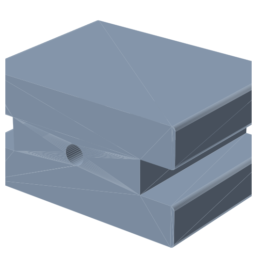 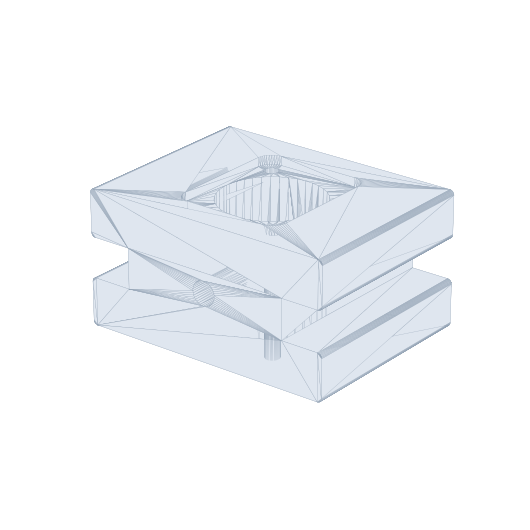

*Left to right: corner, blank center, Neutrik center.*

| Part | Size | Notes |
|---|---|---|
| Corner support | 34.599 x 45.0 x 34.599 mm | L shaped, outer corner radiused to match the panel |
| Blank center support | 60.0 x 45.0 x 31.0 mm | mid span on each 451 mm edge |
| Neutrik center support | 60.0 x 45.0 x 31.0 mm | same outside, with a 24 x 24 mm aperture through it |

All three are a straight 45 mm extrusion of a single profile, with one 5.6 mm bore
running the full length for the heat set inserts. The Neutrik version adds a
24 x 24 mm opening for a Neutrik D series panel connector; it is otherwise
identical to the blank.

 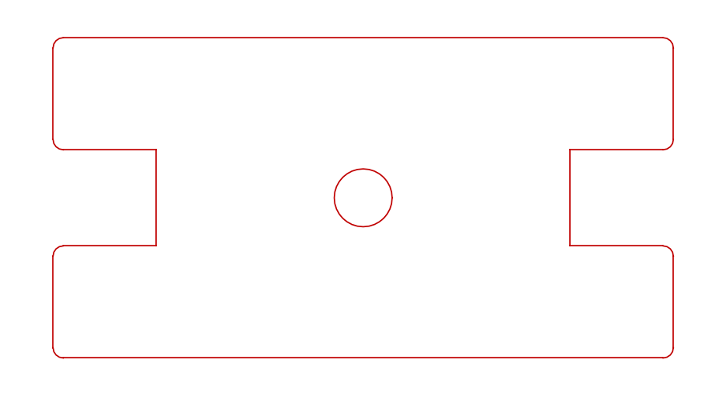

*The two profiles that ship as DXF. Left: corner. Right: blank center.*

**The corner and blank center supports also ship as DXF**, because that profile is
all they are. If you would rather laminate them from acrylic offcuts than print
them, cut the profile and stack it to 45 mm. The Neutrik support has no DXF,
because its aperture is an internal feature that a single profile cannot describe.

### Three fits, because the acrylic has a tolerance

The supports grip the wall in a slot, and the wall is a **laminate**: a 5.6 mm
inner layer and a 3.0 mm outer layer, each with its own tolerance. Work the stack
through and the wall can arrive anywhere in a 1.4 mm band:

| | Inner | Outer | Wall |
|---|---:|---:|---:|
| Thinnest | 5.2 | 2.7 | **7.9 mm** |
| Nominal | 5.6 | 3.0 | **8.6 mm** |
| Thickest | 6.0 | 3.30 | **9.3 mm** |

So the supports come in three fits, differing **only** in the width of that slot.
Same envelope, same insert bore, same everything else.

| Fit | Slot opening | Print this when |
|---|---:|---|
| As supplied, no suffix | **9.3 mm** | you do not know what your acrylic measures. Cut for the thickest the stack can be, so it always goes together |
| `_NominalFit` | **8.6 mm** | your acrylic measures on the nominal 5.6 and 3.0 |
| `_TightFit` | **8.2 mm** | your acrylic came in thin, or you want the wall gripped rather than located |

Every one of those numbers is measured back out of the shipped model, and the
slot runs the full 45 mm through the part with a small lead in at each mouth so
the wall starts square.

> **Availability:** `_NominalFit` ships for all three supports. `_TightFit`
> currently ships for the blank center support only; the Neutrik center and
> corner versions will follow.

**Measure your acrylic before you print.** A caliper on an offcut of each layer
takes a moment and tells you which one to run. If you are between two, print the
looser: a support that is a little slack still locates the wall, and one that is
too tight will not seat at all, or will split along the print layers when you
force it.

Which fits ship today:

| Part | As supplied, 9.3 | Nominal, 8.6 | Tight, 8.2 |
|---|---|---|---|
| Corner support | yes | yes | not yet |
| Blank center support | yes | yes | yes |
| Neutrik center support | yes | yes | not yet |

The two missing tight variants are being drawn. Until they are here, print the
nominal and check the fit on a test piece.

## What is not here

Stated plainly so nobody hunts for something that was never in the folder:

- **`Neutrik_CenterSupport.DXF`** does not exist. Its aperture is an internal
  feature, and a single extrusion profile cannot describe it.
- **Countersink depth** is not in the files. It depends on the flat head screws you
  use, and the DXFs carry the through holes only.
- **Assembly order and screw lengths for the case itself** depend on your final
  stack thickness, which moves with the material tolerance, so measure before you
  buy screws. The bracket's screw lengths are given above and do not move.

## About these files

Eight of the DXFs came straight out of SolidWorks and keep their original
filenames exactly as they came. The other sixteen, the four outer panels and the
twelve button walls, are generated from those eight: features are deleted or added
and the rest of the geometry is carried across untouched, so a wall in a button
variant is the same wall, not a redrawn one.

The fight board bracket is the exception, being modeled rather than derived. Its
mounting pattern is measured off `Top - Outline 1 - Inner - Plexi Case Parts.DXF`,
not assumed, and the exported STL is checked for watertightness and consistent
winding, against the solid's own volume, and by firing a ray through every bore to
confirm its position and depth.

**The SolidWorks sources ship too**, five `.SLDPRT` files.
`All Plexi Case Parts.SLDPRT` is the multibody source for the set.
`CornerSupport.SLDPRT`, `Blank_CenterSupport.SLDPRT` and
`Neutrik_CenterSupport.SLDPRT` are the printed parts, each with a neutral STEP and
STL beside it. `Top Panel.SLDPRT` is the one with no neutral companion, so it is
only usable in SolidWorks.

## License

Same as the rest of this repository: **Creative Commons Attribution-ShareAlike 4.0
International**. See [LICENSE](../LICENSE) and [NOTICE.md](../NOTICE.md).

These case files were created by [JasensCustoms.com](https://www.jasenscustoms.com).
