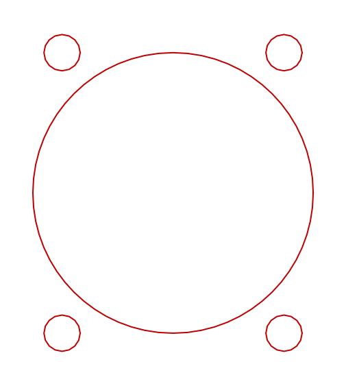
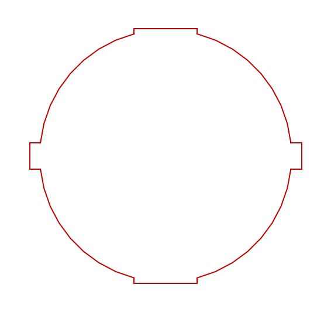

# Support hardware

Cut files for the hardware that goes **around** a panel rather than in it: connectors, pass throughs, and anything else that needs a hole in a case wall or a plate.

Everything here is drawn 1:1 in millimeters, in DXF and SVG, on the same conventions as the rest of the repository. Drop one into a case wall or a panel file, move it where you want it, and cut. The origin of each file is the center of its main bore, so positioning is a single translation.

These are **panel cutouts, not parts**. Nothing here draws the connector itself, the wall it sits in, or the outline of anything. Each file is exactly the set of holes that one piece of hardware needs.

---

## Contents

| Hardware | Cutout | Files |
|---|---|---|
| [Neutrik D-shape USB pass through](#neutrik-d-shape-usb-pass-through) | 24.0 mm bore, 4 mounting holes | [`NeutrikCutout.DXF`](NeutrikCutout.DXF) &middot; [`NeutrikCutout.SVG`](NeutrikCutout.SVG) &middot; [`NeutrikCutout.SLDPRT`](NeutrikCutout.SLDPRT) |
| [E-Switch RR1 round rocker switch](#e-switch-rr1-round-rocker-switch) | 20.0 mm bore, 4 notches | [`ESwitchRR1SeriesCutout.DXF`](ESwitchRR1SeriesCutout.DXF) &middot; [`ESwitchRR1SeriesCutout.SVG`](ESwitchRR1SeriesCutout.SVG) &middot; [`ESwitchRR1SeriesCutout.SLDPRT`](ESwitchRR1SeriesCutout.SLDPRT) |

---

## Neutrik D-shape USB pass through

*The cutout as it is drawn: one 24 mm bore and four 3.1 mm mounting holes.*

The panel cutout for a **Neutrik D-shape USB pass through**, the part most people put in the back of a stick so the cable plugs into the case instead of into the board. Neutrik's own name for that part is a gender changer: it takes USB in one side and out the other, so the board keeps a short internal cable and the outside of the case takes the wear.

> "Reversible USB 2.0 gender changer (type A and B), Nickel D-housing"
>
> "Universally accepted standard D-shape housing"
>
> *Neutrik, [NAUSB-W product page](https://www.neutrik.com/en/product/nausb-w)*

### This cutout is not Neutrik specific

**The D-shape is a de facto industry standard, and that is the point of this file.** Neutrik calls the housing "universally accepted" above, and states the cutout size plainly in its D series chassis connector data:

> "Standardized D sized 24 mm panel cutout"
>
> *Neutrik, [NC3MD-L-1 datasheet](https://www.neutrik.com/en/product/nc3md-l-1.pdf)*

So **any pass through built to the D-shape standard will fit this hole**, whatever the brand and whatever passes through it. The same 24 mm cutout takes D-shape USB, XLR, Ethercon, HDMI, 3.5 mm, and the blanking plates, from Neutrik and from everyone who builds to the same shell. If you decide later that you want Ethernet instead of USB, the hole does not change.

The D series is described by Neutrik as a "Unified D-size shell for male and female" with "Countersunk mounting holes to accept M3 bolts or rivets", for a "Panel thickness 1 - 3 mm" ([D Series](https://www.neutrik.com/en/neutrik/products/xlr-connectors/xlr-chassis-connectors/d-series)). The panel thickness range is worth checking against your own build: the case in this repository laminates a 5.6 mm inner layer and a 3.0 mm outer layer, so a D-shape part goes in a **side wall**, not through the full stack.

### What is in the file

| Feature | Size | Position from the bore center |
|---|---:|---|
| Main bore | 24.0 mm | (0, 0) |
| Mounting hole | 3.1 mm | (-9.5, +12.0) |
| Mounting hole | 3.1 mm | (+9.5, +12.0) |
| Mounting hole | 3.1 mm | (+9.5, -12.0) |
| Mounting hole | 3.1 mm | (-9.5, -12.0) |

The four mounting holes sit on the corners of a **19.0 by 24.0 mm rectangle**. Overall extent is 24.0 by 27.1 mm. The 3.1 mm holes are sized for **M3** hardware, which is what the D series calls for.

### Why four mounting holes when the standard uses two

**A D-shape part is held by two screws on a diagonal, not four.** This file draws all four corners anyway, and that is deliberate.

Which diagonal a given part uses depends on how it is built and which way round it is fitted. Parts exist with the pair reversed, and a pass through that can be installed either way up is exactly the sort of thing that ends up rotated 180 degrees on the bench. Cutting one diagonal means committing to an orientation before you have the part in your hand.

Cutting all four takes both diagonals, so:

- **any D-shape part fits, either diagonal, either way up**
- you can rotate the part after the panel is cut, for cable clearance or for how the logo sits
- the two holes you do not use are 3.1 mm and hidden behind the connector flange

The cost is two extra small holes in a piece of acrylic that nobody will ever see. That is a trade worth making for a file meant to be universal.

If you would rather cut only the two you need, delete the other pair before sending the file. Everything is on one layer and each hole is a separate circle.

---

## E-Switch RR1 round rocker switch

*One closed profile: a 20 mm bore with two anti-rotation slots and two shallow notches.*

The panel cutout for an **E-Switch RR1 series round rocker switch**, a snap in power rocker. On a fight stick it has two jobs worth doing, and which one you want decides which version of the switch to buy.

> "Round, Illuminated, Power Rocker Switch with PVC Cap"
>
> Panel mount snap in, with a circular **20 mm diameter panel cutout**. Up to 16 A at 125 VAC, SPST or SPDT, off-on / on-off-on / on-on latching, illuminated or not, and IP54 rated with the optional PVC cap.
>
> *E-Switch, [RR1 series product page](https://www.e-switch.com/product/rr1-series-round-illuminated-power-rocker-switch-with-pvc-cap/)*

### What to use it for

Both uses come out of the latching options quoted above. Buy the switch to match the job.

#### SPST, off-on: a lock for the auxiliary buttons

Start, Select, Home and Touchpad are the buttons you never want to catch mid match. Put the switch in their ground path and you can turn them off:

- **one side of the switch** takes the ground wires from Start, Select, Home, Touchpad and anything else you want locked out, tied together
- **the other side** takes a real ground back to the fight board

Switch on and those buttons work normally. Switch off and their ground path is broken, so none of them can register and an accidental press does nothing. Nothing about the signal wiring changes; the switch only ever interrupts the return.

> **Give the auxiliary buttons their own ground chain.** Most sticks daisy chain a single ground around every button on the panel. If your auxiliary buttons sit on that same chain, the switch will cut the action buttons along with them. Split it: action buttons on their own ground straight to the board, auxiliary buttons on a separate chain that runs through the switch.

The switch is carrying button ground, which is a signal level current nowhere near the RR1's 16 A rating. Choose one for the feel, the marking and the illumination rather than for the amps.

#### SPDT, on-off-on: a three position lever mode switch

The same cutout takes the three position version. **If your fight board supports it**, those three positions change what the lever reports: **D-pad**, **left stick** and **analog stick**. That is a mode a lot of players would rather have on the outside of the case than buried in a button combination.

Check your board's documentation before wiring this one. Boards differ on whether they expose a mode input at all and on what they expect to see on it, which is why this is an "if it supports it" rather than a given.

**It snaps in, so there are no mounting holes.** The switch body has retention barbs that grip the panel, which is why the cutout carries notches instead of screws. Check the switch's own panel thickness range against whatever you are cutting: a snap in needs the panel thin enough for the barbs to clear and thick enough to hold.

### What is in the file

One **closed profile**, not a set of separate holes. Every arc and line joins end to end, so a cutter follows it as a single path.

| Feature | Size |
|---|---|
| Bore | 20.0 mm diameter |
| Anti-rotation slots | 2 off, 2.1 mm wide, on the horizontal axis, out to a 21.6 mm span |
| Shallow notches | 2 off, 5.0 mm wide, on the vertical axis, out to a 20.2 mm span |

The two 2.1 mm slots are the ones that stop the switch turning in the hole. The two 5.0 mm notches are much shallower, 0.1 mm past the bore, and clear the body's molding.

**Orientation matters on this one.** The slots and notches are on different axes and different sizes, so the file is drawn the way the switch goes in. Rotating it 90 degrees will not fit. If you want the rocker to throw the other way, rotate the file 180 degrees, not 90.

---

## Using these with the case

The [case](../case/README.md) side walls are the natural home for a pass through. They are 55.0 mm across with a 45.0 mm body between the tab shoulders, so a 24 mm bore centered on that body leaves about 10.5 mm of material above and below it. Check that against your own layout before cutting, and remember that the wall is a **laminate**: the inner layer is 5.6 mm and the outer 3.0 mm, and a D-shape part is specified for a 1 to 3 mm panel.

The case already ships a `Neutrik_CenterSupport` printed part for mounting a D-shape connector on the center support rather than a wall. That is a different approach to the same problem, and which suits you depends on where your cable needs to come out.

The rocker is the easier of the two to place: it is a single 21.6 by 20.2 mm profile with no fasteners, so it drops into a side wall or a blank area of a panel wherever there is room behind it for the switch body and its terminals.

---

## About these files

The DXF is the original, drawn by JasensCustoms.com in SolidWorks, with the `.SLDPRT` source alongside it. The SVG and the preview are derived from that DXF rather than redrawn, and the cut geometry is verified entity for entity as unchanged when they are generated.

**No file here contains text of any kind.** Annotations belong on a drawing, not in a cut file, and a machine will happily engrave one that was left behind.

New hardware is welcome. A cutout needs to be true scale, in millimeters, with its origin on the main bore, and it needs a section here saying what hardware it fits and where the dimensions came from.

---

## License

Same as the rest of this repository: **CC BY-SA 4.0**. See [`../LICENSE`](../LICENSE).

Created by [JasensCustoms.com](https://www.jasenscustoms.com). Neutrik and E-Switch product names, and the specifications quoted above, belong to those manufacturers and are cited here only to identify what each cutout fits. Nothing of theirs is redistributed. Every dimension in these files was drawn by JasensCustoms.com and measured back out of the file itself, not lifted from a manufacturer drawing.
